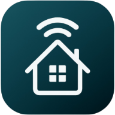
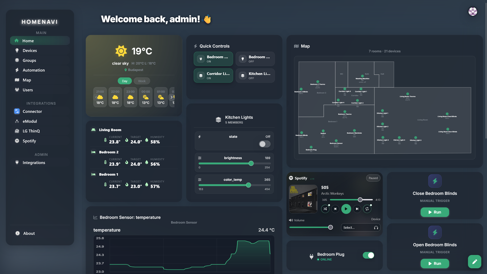

<p align="center">
  
</p>

<h1 align="center">Homenavi</h1>

<p align="center"><strong>Open smart-home platform with a microservice core, MQTT/HDP realtime plane, and integration-first extensibility.</strong></p>

<p align="center">
  <a href="#quickstart">Quickstart</a> •
  <a href="doc/architecture_diagram.md">Architecture</a> •
  <a href="doc/gallery.md">Gallery</a> •
  <a href="https://github.com/PetoAdam/homenavi/issues">Issues</a>
</p>

<p align="center">
  
</p>

<p align="center"><a href="doc/gallery.md">View the full screenshot gallery</a></p>

---

## Table of contents
1. Why Homenavi
2. Current architecture
3. Quickstart
4. Deployments (Docker and Kubernetes)
5. Service map
6. Current capabilities
7. Integrations and extension model
8. Observability and security snapshot
9. Documentation map
10. FAQ
11. Contributing
12. License

---

## 1. Why Homenavi
Homenavi is designed for people who want full control over smart-home behavior without locking themselves into one vendor ecosystem.

What it emphasizes today:
- Service boundaries that are explicit and replaceable.
- Realtime device/event handling over MQTT with a normalized HDP contract.
- Canonical inventory ownership via ERS (names, rooms, tags, map metadata).
- Highly customizable dashboards, widget composition, automation workflows, and integration-driven extension points.
- Role-aware user management, groups, and realtime communication across UI and services.
- Straightforward local operation with Docker Compose and a path to Kubernetes.

## 2. Current architecture
Homenavi runs as a layered system:
- Browser app (PWA frontend).
- Nginx ingress for HTTPS/WSS.
- API Gateway for auth checks, routing, and websocket upgrades.
- Domain services (auth, user, dashboard, device-hub, ERS, history, automation, weather).
- Integration runtime via integration-proxy and installed integrations.
- Shared messaging via EMQX (HDP topics).

Primary references:
- Architecture + flow diagrams: [doc/architecture_diagram.md](doc/architecture_diagram.md)
- ERS/HDP/device-hub interaction: [doc/ers_hdp_devicehub_overview.md](doc/ers_hdp_devicehub_overview.md)
- HDP contract and topic model: [doc/hdp.md](doc/hdp.md)
- API surface: [doc/external_api_surface.md](doc/external_api_surface.md)

<a id="quickstart"></a>
## 3. Quickstart

### Local (Docker Compose)
```sh
git clone https://github.com/PetoAdam/homenavi.git
cd homenavi
cp .env.example .env
docker compose up --build
```

Notes:
- The stack defaults to EMQX for MQTT.
- Mock adapter is opt-in via profile.
- zigbee2mqtt is included and can be used with a USB coordinator.

## 4. Deployments (Docker and Kubernetes)

### Docker deployment
Use Compose as the canonical local and small-instance deployment path:
- Build/run details: [doc/local_build.md](doc/local_build.md)
- Nginx behavior and TLS/dev modes: [doc/nginx_guide.md](doc/nginx_guide.md)
- MQTT bridging patterns: [doc/mqtt_broker_topologies.md](doc/mqtt_broker_topologies.md)

### Kubernetes deployment
Use Helm for cluster deployment:
```sh
helm upgrade --install homenavi ./helm/homenavi -n homenavi --create-namespace
```

Operational runbooks:
- Minikube MVP path: [doc/minikube_helm_mvp_runbook.md](doc/minikube_helm_mvp_runbook.md)
- HA/operations notes: [doc/helm_ha_operations.md](doc/helm_ha_operations.md)
- Deployment model guidance: [doc/deployment_modes_compose_helm_implementation_plan.md](doc/deployment_modes_compose_helm_implementation_plan.md)

## 5. Service map

| Domain | Services | Responsibility |
|---|---|---|
| Ingress and edge API | nginx, api-gateway | Public HTTPS/WSS ingress, auth checks, route and websocket dispatch |
| Identity and access | auth-service, user-service | Login/session/JWT, lockouts/2FA, RBAC-aware user profiles, roles and admin operations |
| Home model and state | entity-registry-service, device-hub, history-service | Canonical inventory, rooms/tags/groups/map metadata, HDP command/state plane, historical state persistence |
| Automation and UI model | automation-service, dashboard-service | Workflow engine, run stream, widget and dashboard persistence |
| Integrations runtime | integration-proxy, installed integrations | Registry, UI/API proxying, install/update orchestration, integration action execution |
| Supporting services | weather-service, email-service, profile-picture-service, echo-service | Weather facade, outbound email, avatar storage, websocket diagnostics |
| Messaging and data infra | EMQX, PostgreSQL, Redis, MinIO | MQTT backbone, relational storage, cache/rate-limit state, object storage |

## 6. Current capabilities

### Devices and realtime
- HDP-based command and state model across adapters and integrations.
- Zigbee path through zigbee2mqtt and zigbee-adapter.
- MQTT-over-WebSocket for live device updates in UI.
- Realtime communication for device state, command lifecycle, automation runs, and inventory change notifications.
- ERS auto-import/binding of HDP identities to canonical inventory.

### Inventory and map
- Rooms/tags/device metadata owned in ERS.
- Interactive drag-and-drop map editing with persisted room geometry, device placement, and favorites.
- Device and inventory grouping through room/tag/group selector semantics.
- Selector resolution for automation targeting (room/tag/group semantics).

### Automation engine
- Manual, device-state, and schedule triggers.
- Drag-and-drop workflow authoring in the UI backed by branching, loop, sleep, and device command actions.
- Integration actions via integration runtime metadata and execute endpoint.
- Live run stream websocket endpoint.

### Dashboards and widgets
- User-scoped dashboards with persisted layout/state and edit-mode customization with simple drag-and-drop placement and resizing.
- Custom widget composition, placement, and integration widget discovery through integration-proxy registry.

### Identity, users, and access
- User-service backed profile and administrative user management.
- Role-aware and admin-oriented flows across gateway-protected APIs.
- Auth-service and user-service split keeps credentials/session logic separate from user domain data.

### Marketplace-backed integrations
- Runtime install/update model through integration-proxy.
- Artifact-driven deployment metadata (Compose/Helm).
- OIDC-based publishing and verify/release gate expectations.

## 7. Integrations and extension model

Existing integration repositories you can use as references:
- Official template: https://github.com/PetoAdam/homenavi-integration-template
- Spotify integration: https://github.com/PetoAdam/homenavi-spotify
- Connector integration: https://github.com/PetoAdam/homenavi-connector

How to extend:
- Start from template + manifest + marketplace metadata.
- Implement sidebar/widget UI and optional automation/device extensions.
- Publish through verify/release pipelines and marketplace metadata contract.

Read the dedicated docs:
- Integration extension contract: [doc/integration_device_and_automation_extensions.md](doc/integration_device_and_automation_extensions.md)
- Marketplace/integration roadmap: [doc/dashboard_widgets_integrations_marketplace_roadmap.md](doc/dashboard_widgets_integrations_marketplace_roadmap.md)
- LG ThinQ implementation POC: [doc/poc_lg_thinq_integration_v2.md](doc/poc_lg_thinq_integration_v2.md)

## 8. Observability and security snapshot

### Observability
- Metrics via Prometheus scrape endpoints.
- Traces exported to Jaeger for currently instrumented services.
- Correlation IDs propagated through gateway/service hops.

Services with OTEL tracing support today:
- api-gateway, auth-service, user-service, dashboard-service, device-hub, email-service, zigbee-adapter, mock-adapter.

Services without first-class OTEL tracing support yet:
- automation-service, entity-registry-service, history-service, integration-proxy, weather-service.

### Security
- RS256 JWT signing/verification split.
- Email-based 2FA flow and lockout policy.
- Redis-backed rate limiting and lockout state.
- Integration runtime privilege boundaries depend on deployment mode; treat docker-socket access as high trust.

## 9. Documentation map
- Architecture diagrams and message flows: [doc/architecture_diagram.md](doc/architecture_diagram.md)
- API endpoint map: [doc/external_api_surface.md](doc/external_api_surface.md)
- MQTT/HDP contract and interoperability: [doc/hdp.md](doc/hdp.md), [doc/mqtt_broker_topologies.md](doc/mqtt_broker_topologies.md)
- Local developer setup: [doc/local_build.md](doc/local_build.md)
- Kubernetes runbook: [doc/minikube_helm_mvp_runbook.md](doc/minikube_helm_mvp_runbook.md)
- Screenshot gallery: [doc/gallery.md](doc/gallery.md)

## 10. FAQ

**Can I run it on a Raspberry Pi?** Yes. All the services are written in Go, so you can run Homenavi on a single-board computer without any issues. The platform is intended to work in homelab environments as well as larger deployments, but validate the exact images, storage, and attached hardware path you need.

**Is it production ready?** The platform is actively evolving. Core auth, user management, dashboards, HDP device handling, and automation foundations are implemented, but you should still review the current service set and deployment model for your use case.

**Does it support realtime updates?** Yes. Homenavi uses websocket and MQTT-backed flows for device state, command lifecycle, automation run updates, and inventory refresh notifications.

**Can I add my own device protocol or cloud integration?** Yes. The preferred path is an integration or adapter that speaks HDP and, when needed, exposes UI and automation extensions through the integration runtime.

**Can I build custom widgets or dashboards?** Yes. The dashboard model is intentionally customizable and supports first-party plus integration-provided widgets.

**How do integrations get published?** Integration repositories should use the template plus the shared verify/release actions and publish marketplace metadata through the OIDC-backed release flow.

**Where should I look for Kubernetes deployment guidance?** Start with [doc/minikube_helm_mvp_runbook.md](doc/minikube_helm_mvp_runbook.md) and [doc/helm_ha_operations.md](doc/helm_ha_operations.md).

## 11. Contributing
Contributions are welcome:
1. Fork and create a focused branch.
2. Keep changes scoped and include tests/docs where relevant.
3. Open a pull request with rationale and validation notes.

Issues: https://github.com/PetoAdam/homenavi/issues

## 12. License
MIT License. See [LICENSE](LICENSE).

### Icon attribution
Font Awesome Free icons are used in the UI and are licensed under CC BY 4.0:
https://fontawesome.com/license/free
