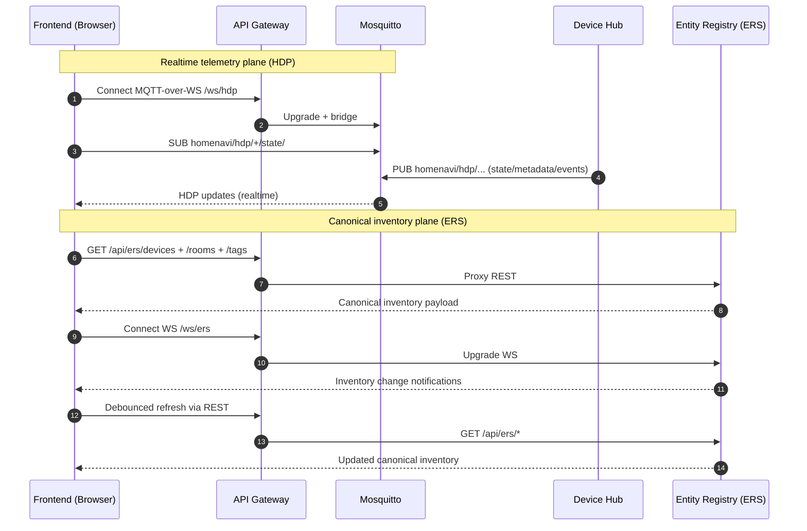

# Homenavi architecture diagram (current)

This repo is easiest to understand as three planes:

- **Client plane**: browser UI (frontend)
- **Edge / device plane**: adapters + MQTT (HDP)
- **Core plane**: gateway + domain services + data stores

## High-level system diagram

```mermaid
flowchart TB
  %% Client plane
  subgraph Client["Client plane"]
    Browser["Frontend PWA (Browser)"]
  end

  %% Edge / device plane
  subgraph Edge["Edge / device plane"]
    Zigbee["Zigbee Adapter"]
    Thread["Thread Adapter"]
  end

  %% Core plane
  subgraph Core["Core plane"]
    Nginx["Nginx"]
    Gateway["API Gateway"]

    Auth["Auth Service"]
    User["User Service"]
    DeviceHub["Device Hub"]
    History["History Service"]
    Automation["Automation Service"]
    ERS["Entity Registry (ERS)"]
    Dashboard["Dashboard Service"]
    Weather["Weather Service"]
    Integrations["Integration Proxy"]

    Echo["Echo Service"]
    Email["Email Service"]
    ProfilePic["Profile Picture Service"]

    Mosquitto["Mosquitto (MQTT broker)"]
    Postgres[("PostgreSQL")]
    Redis[("Redis")]

    Prom["Prometheus"]
    Jaeger["Jaeger"]
  end

  %% Integrations plane (example)
  subgraph IntegrationsPlane["Integrations plane"]
    Spotify["Spotify Integration (Example)"]
    ExternalAPI["External API (Spotify)"]
  end

  %% Entry points
  Browser -->|HTTP| Nginx
  Nginx -->|"/ (SPA) static assets"| Browser
  Nginx -->|"/api/* + /ws/*"| Gateway
  Nginx -->|"/integrations/*"| Integrations

  %% Gateway → services (REST)
  Gateway -->|REST| Auth
  Gateway -->|REST| User
  Gateway -->|"REST /api/hdp/*"| DeviceHub
  Gateway -->|REST| History
  Gateway -->|REST| Automation
  Gateway -->|"REST /api/ers/*"| ERS
  Gateway -->|REST| Dashboard
  Gateway -->|REST| Weather

  %% WebSockets
  Browser <-->|"WS /ws/ers"| Gateway
  Gateway <-->|"WS upstream"| ERS

  Browser <-->|"MQTT-over-WS /ws/hdp"| Gateway
  Gateway <-->|"MQTT-over-WS upstream"| Mosquitto

  Browser <-->|"WS /ws/echo"| Gateway
  Gateway <-->|"WS upstream"| Echo

  %% Integrations
  Dashboard -->|"registry + widgets"| Integrations
  Integrations -->|"HTTP (invoke/health)"| Spotify
  Spotify -->|"OAuth + Web API"| ExternalAPI

  %% MQTT (HDP)
  Zigbee <-->|"MQTT (HDP topics)"| Mosquitto
  Thread <-->|"MQTT (HDP topics)"| Mosquitto
  DeviceHub <-->|"MQTT subscribe/publish"| Mosquitto
  ERS <-->|"MQTT subscribe (auto-import)"| Mosquitto

  %% Persistence
  User -->|SQL| Postgres
  Auth -->|"SQL (tokens/users etc.)"| Postgres
  DeviceHub -->|"SQL (devices, metadata)"| Postgres
  History -->|"SQL (state history)"| Postgres
  Automation -->|"SQL (automation rules)"| Postgres
  Dashboard -->|"SQL (dashboards/widgets)"| Postgres
  ERS -->|"SQL (inventory)"| Postgres

  Gateway -->|"rate limit/session"| Redis
  Auth -->|"lockouts/2FA state"| Redis

  %% Internal service calls
  Auth -->|"email verification/2FA"| Email
  Automation -->|"alert notifications"| Email
  Auth -->|"profile pictures"| ProfilePic

  %% Observability
  Gateway -->|metrics| Prom
  DeviceHub -->|metrics| Prom
  Auth -->|metrics| Prom
  User -->|metrics| Prom
  History -->|metrics| Prom
  Automation -->|metrics| Prom
  ERS -->|metrics| Prom

  Gateway -->|traces| Jaeger
  DeviceHub -->|traces| Jaeger
  Auth -->|traces| Jaeger
  User -->|traces| Jaeger
  History -->|traces| Jaeger
  Automation -->|traces| Jaeger
  ERS -->|traces| Jaeger
```

## Real-time device data vs canonical inventory

- **HDP (via MQTT)** is the realtime plane: telemetry, state, events, pairing, commands.
- **ERS (Entity Registry)** is the canonical plane: device names, rooms, tags, map metadata, and bindings to HDP ids.

## Notes

- The websocket `/ws/ers` is intentionally a **change notification stream**; clients fetch canonical payloads via REST.
- The websocket `/ws/hdp` is MQTT-over-websocket for realtime HDP traffic (telemetry/events/commands).

Related docs:
- [doc/ers_hdp_devicehub_overview.md](doc/ers_hdp_devicehub_overview.md)
- [doc/hdp.md](doc/hdp.md)
- [doc/external_api_surface.md](doc/external_api_surface.md)
