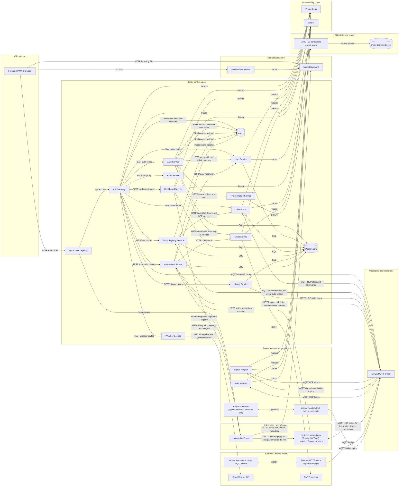
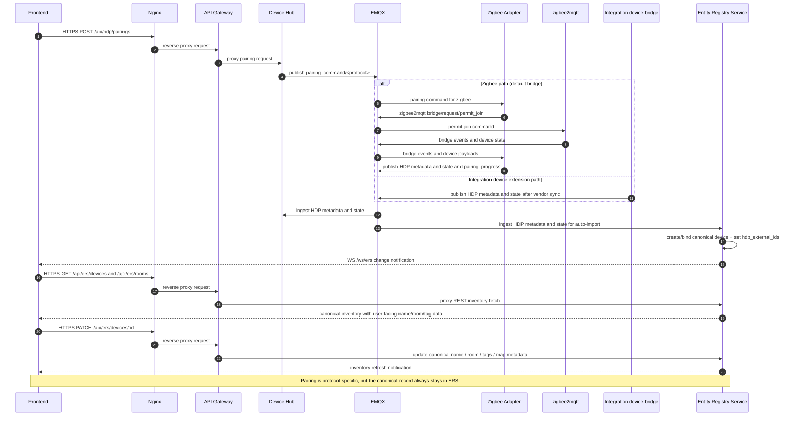
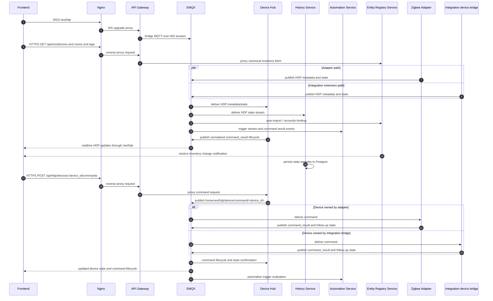
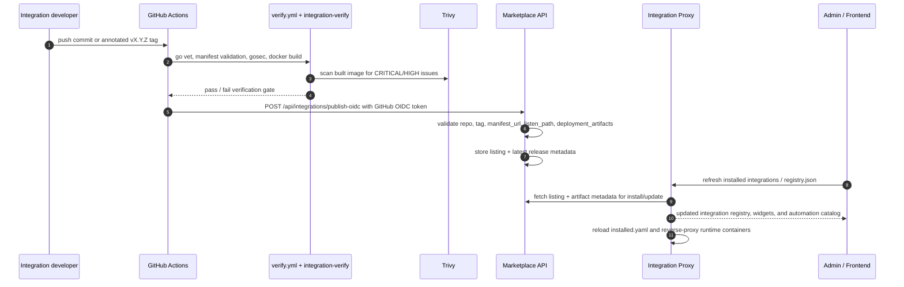

# Homenavi architecture diagram (corrected)

This repo is easiest to understand as eight planes:

- **Client plane**: browser UI (frontend)
- **Core / control plane**: gateway + domain services + data stores
- **Edge / device plane**: protocol adapters and edge bridges
- **Integration runtime plane**: integration-proxy + installed integration containers
- **Marketplace plane**: marketplace API + marketplace web
- **Messaging plane**: EMQX as shared MQTT event backbone across core and edge
- **Object storage plane**: MinIO + profile picture bucket
- **External / interop plane**: OpenWeather, SMTP, external MQTT ecosystems
- **Observability plane**: Prometheus + Jaeger

The diagram below intentionally keeps the marketplace API out of the core plane and shows the integration runtime as a separate boundary between first-party services and third-party containers.
For core app traffic, HTTPS and WSS requests always traverse Browser -> Nginx -> API Gateway before reaching internal core services.

## High-level system diagram

```mermaid
flowchart LR
  %% Client plane
  subgraph Client["Client plane"]
    Browser["Frontend PWA (Browser)"]
  end

  %% Ingress / core control plane
  subgraph Core["Core / control plane"]
    Nginx["Nginx reverse proxy"]
    Gateway["API Gateway"]

    Auth["Auth Service"]
    User["User Service"]
    Dashboard["Dashboard Service"]
    DeviceHub["Device Hub"]
    ERS["Entity Registry Service"]
    History["History Service"]
    Automation["Automation Service"]
    Weather["Weather Service"]
    Email["Email Service"]
    Echo["Echo Service"]
    ProfilePic["Profile Picture Service"]

    Postgres[("PostgreSQL")]
    Redis[("Redis")]
  end

  %% Messaging backbone plane
  subgraph Messaging["Messaging plane (shared)"]
    EMQX["EMQX MQTT broker"]
  end

  %% Edge and protocol bridge plane
  subgraph Edge["Edge / protocol bridge plane"]
    Zigbee2MQTT["zigbee2mqtt (default bridge, optional)"]
    Zigbee["Zigbee Adapter"]
    Mock["Mock Adapter"]
    PhysicalDevices["Physical devices\n(Zigbee, sensors, switches, etc.)"]
  end

  %% Integration runtime plane
  subgraph IntegrationRuntime["Integration runtime plane"]
    IntegrationProxy["Integration Proxy"]
    InstalledIntegrations["Installed integrations\n(Spotify, LG ThinQ, eModul, Connector, etc.)"]
  end

  %% Marketplace plane
  subgraph MarketplacePlane["Marketplace plane"]
    MarketplaceWeb["Marketplace Web UI"]
    MarketplaceAPI["Marketplace API"]
  end

  %% Storage/object plane
  subgraph StoragePlane["Object storage plane"]
    MinIO["MinIO (S3-compatible object store)"]
    Bucket[("profile-pictures bucket")]
  end

  %% External systems plane
  subgraph ExternalPlane["External / interop plane"]
    ExternalBroker["External MQTT broker\n(optional bridge)"]
    HomeAssistant["Home Assistant or other MQTT clients"]
    OpenWeather["OpenWeather API"]
    SMTP["SMTP provider"]
  end

  %% Observability plane
  subgraph Observability["Observability plane"]
    Prom["Prometheus"]
    Jaeger["Jaeger"]
  end

  %% Consistent ingress chain
  Browser -->|HTTPS and WSS| Nginx
  Nginx -->|/api and /ws| Gateway
  Nginx -->|/integrations| IntegrationProxy

  %% Marketplace access (separate stack)
  Browser -->|HTTPS| MarketplaceWeb
  Browser -->|HTTPS catalog API| MarketplaceAPI
  MarketplaceWeb -->|REST| MarketplaceAPI

  %% Gateway fan-out to core services
  Gateway -->|REST auth routes| Auth
  Gateway -->|REST user routes| User
  Gateway -->|REST dashboard routes| Dashboard
  Gateway -->|REST ers routes| ERS
  Gateway -->|REST hdp routes| DeviceHub
  Gateway -->|REST history routes| History
  Gateway -->|REST automation routes| Automation
  Gateway -->|REST weather routes| Weather
  Gateway -->|WS echo proxy| Echo
  Gateway -->|MQTT-over-WS proxy| EMQX

  %% Service-to-service HTTP dependencies
  Auth -->|HTTP user profile and admin lookups| User
  Auth -->|HTTP send verification and 2FA emails| Email
  Auth -->|HTTP avatar upload and read| ProfilePic
  Automation -->|HTTP user resolution| User
  Automation -->|HTTP notify email| Email
  Automation -->|HTTP integration steps and registry| IntegrationProxy
  Automation -->|HTTP action.integration execute| InstalledIntegrations
  Dashboard -->|HTTP integration registry and widgets| IntegrationProxy
  ERS -->|HTTP backfill of discovered HDP devices| DeviceHub
  IntegrationProxy -->|HTTP reverse proxy to integration UIs and APIs| InstalledIntegrations
  IntegrationProxy -->|HTTP listing and artifact metadata| MarketplaceAPI

  %% MQTT event backbone (HDP and bridge topics)
  DeviceHub <-->|MQTT HDP state and commands| EMQX
  ERS <-->|MQTT HDP metadata and event auto-import| EMQX
  History <-->|MQTT HDP state ingest| EMQX
  Automation <-->|MQTT trigger subscribe and command publish| EMQX
  Zigbee <-->|MQTT HDP topics| EMQX
  Zigbee <-->|MQTT zigbee2mqtt bridge topics| EMQX
  Mock <-->|MQTT HDP topics| EMQX
  InstalledIntegrations <-->|MQTT HDP topics for integration device extensions| EMQX
  ExternalBroker <-->|MQTT bridge| EMQX
  HomeAssistant <-->|MQTT| ExternalBroker

  %% Edge device transport chain
  PhysicalDevices <-->|Zigbee RF| Zigbee2MQTT
  Zigbee2MQTT <-->|MQTT bridge topics| EMQX

  %% Persistence and caches
  Auth -->|SQL| Postgres
  User -->|SQL| Postgres
  Dashboard -->|SQL| Postgres
  DeviceHub -->|SQL| Postgres
  ERS -->|SQL| Postgres
  History -->|SQL| Postgres
  Automation -->|SQL| Postgres
  Gateway -->|Redis rate limits and sessions| Redis
  Auth -->|Redis lockouts and one-time codes| Redis
  Dashboard -->|Redis cache optional| Redis
  ERS -->|Redis cache optional| Redis
  Automation -->|Redis cache optional| Redis

  %% Object storage flow
  ProfilePic -->|S3 API| MinIO
  MinIO -->|stores objects| Bucket

  %% External upstream calls
  Weather -->|HTTPS weather and geocoding APIs| OpenWeather
  Email -->|SMTP| SMTP

  %% Observability
  Gateway -->|metrics| Prom
  Auth -->|metrics| Prom
  User -->|metrics| Prom
  Dashboard -->|metrics| Prom
  DeviceHub -->|metrics| Prom
  Email -->|metrics| Prom
  Zigbee -->|metrics| Prom
  Mock -->|metrics| Prom

  Gateway -->|traces| Jaeger
  Auth -->|traces| Jaeger
  User -->|traces| Jaeger
  Dashboard -->|traces| Jaeger
  DeviceHub -->|traces| Jaeger
  Email -->|traces| Jaeger
  Zigbee -->|traces| Jaeger
  Mock -->|traces| Jaeger
```

## Service responsibilities (detailed)

| Service / Component | Primary responsibility | Inbound interfaces | Outbound dependencies |
|---|---|---|---|
| frontend | User-facing SPA/PWA for auth, devices, automations, dashboards, integrations | HTTPS from browser | Nginx entrypoint, Marketplace API |
| nginx | Single ingress for core stack (HTTPS/WSS reverse proxy) | HTTPS/WSS from browser | api-gateway, integration-proxy, frontend static assets |
| api-gateway | Authn/authz edge, route dispatch, WS and MQTT-over-WS upgrade | `/api/*`, `/ws/*` | auth-service, user-service, dashboard-service, device-hub, history-service, automation-service, entity-registry-service, weather-service, echo-service, EMQX |
| auth-service | Login/session/token lifecycle, OAuth start/callback, 2FA and lockout policy | REST via gateway | user-service, email-service, profile-picture-service, Redis, Postgres |
| user-service | User identity/profile/role storage and admin operations | REST via gateway and internal callers | Postgres |
| dashboard-service | Dashboard/widget persistence, integration widget catalog aggregation | REST via gateway | integration-proxy registry, Postgres, optional Redis cache |
| device-hub | HDP command API, normalized command lifecycle, realtime device state projection | REST via gateway, MQTT HDP topics | EMQX, Postgres |
| entity-registry-service (ERS) | Canonical inventory (names/rooms/tags/map metadata), selector resolution, HDP auto-import | REST and WS via gateway, MQTT HDP metadata/events | device-hub backfill API, EMQX, Postgres, optional Redis cache |
| history-service | HDP state ingestion and historical query API | REST via gateway, MQTT HDP state stream | EMQX, Postgres |
| automation-service | Workflow engine, trigger subscriptions, action execution (device + integration) | REST/WS via gateway, MQTT events | EMQX, user-service, email-service, integration-proxy metadata, integration containers, Postgres, optional Redis cache |
| weather-service | Cached weather and geocoding facade for UI | REST via gateway | OpenWeather APIs |
| email-service | Outbound transactional mail (verification/notify) | Internal HTTP from auth/automation | SMTP provider |
| profile-picture-service | Avatar upload/read APIs and object lifecycle | Internal HTTP from auth | MinIO/S3 bucket |
| echo-service | Diagnostic websocket surface for auth + transport verification | WS via gateway | none |
| integration-proxy | Integration registry, UI/API reverse proxy, install/update orchestration | `/integrations/*`, registry/admin endpoints | installed integration containers, Marketplace API, Docker runtime (compose mode) |
| installed integrations | Third-party and first-party extension workloads (UI, devices, automation actions) | proxied HTTP from integration-proxy, optional MQTT command topics | vendor clouds/APIs, EMQX HDP topics |
| zigbee-adapter | HDP<->Zigbee bridge logic, pairing control, command translation | MQTT HDP + zigbee2mqtt bridge topics | EMQX, zigbee2mqtt topics, Postgres, Redis |
| zigbee2mqtt | Zigbee network bridge to MQTT topic model | Zigbee RF + MQTT bridge requests | physical Zigbee devices, EMQX |
| mock-adapter | Test adapter for HDP traffic simulation | MQTT HDP topics | EMQX |
| EMQX | Shared MQTT backbone for HDP, pairing, command/result, optional external bridges | MQTT and MQTT-over-WS | core services, adapters, integrations, optional external broker |
| marketplace API/web (external stack) | Integration catalog, release metadata, publish endpoint and web UI | HTTPS from browser and integration-proxy, CI publish calls | marketplace database, OIDC validation infrastructure |
| minio | S3-compatible object storage for profile pictures | S3 API from profile-picture-service | persistent object volume |
| postgres | Primary relational persistence | SQL from core services | persistent volume |
| redis | Rate limiting, lockout state, optional service caches | TCP from gateway/auth/dashboard/ERS/automation/zigbee-adapter | in-memory dataset/persistence config |

## Device addition and canonical binding

This flow captures both the pairing case and the auto-discovery case. The important boundary is that the adapter and device-hub own realtime HDP identity, while ERS owns the canonical user-facing record.

```mermaid
sequenceDiagram
  autonumber
  participant UI as Frontend
  participant NX as Nginx
  participant GW as API Gateway
  participant DH as Device Hub
  participant MQTT as EMQX
  participant ZA as Zigbee Adapter
  participant Z2M as zigbee2mqtt
  participant IN as Integration device bridge
  participant ERS as Entity Registry Service

  UI->>NX: HTTPS POST /api/hdp/pairings
  NX->>GW: reverse proxy request
  GW->>DH: proxy pairing request
  DH->>MQTT: publish pairing_command/<protocol>

  alt Zigbee path (default bridge)
    MQTT->>ZA: pairing command for zigbee
    ZA->>MQTT: zigbee2mqtt bridge/request/permit_join
    MQTT->>Z2M: permit join command
    Z2M->>MQTT: bridge events and device state
    MQTT->>ZA: bridge events and device payloads
    ZA->>MQTT: publish HDP metadata and state and pairing_progress
  else Integration device extension path
    IN->>MQTT: publish HDP metadata and state after vendor sync
  end

  MQTT->>DH: ingest HDP metadata and state
  MQTT->>ERS: ingest HDP metadata and state for auto-import
  ERS->>ERS: create/bind canonical device + set hdp_external_ids
  ERS-->>UI: WS /ws/ers change notification
  UI->>NX: HTTPS GET /api/ers/devices and /api/ers/rooms
  NX->>GW: reverse proxy request
  GW->>ERS: proxy REST inventory fetch
  ERS-->>UI: canonical inventory with user-facing name/room/tag data
  UI->>NX: HTTPS PATCH /api/ers/devices/:id
  NX->>GW: reverse proxy request
  GW->>ERS: update canonical name / room / tags / map metadata
  ERS-->>UI: inventory refresh notification

  note over UI,ERS: Pairing is protocol-specific, but the canonical record always stays in ERS.
```

## Notes

- The websocket `/ws/ers` is intentionally a **change notification stream**; clients fetch canonical payloads via REST.
- The websocket `/ws/hdp` is MQTT-over-websocket for realtime HDP traffic (telemetry/events/commands) and targets EMQX by default.
- When bridging to older deployments, prefer a direct external-broker-to-EMQX bridge with explicit topic directions.

Related docs:
- [doc/ers_hdp_devicehub_overview.md](doc/ers_hdp_devicehub_overview.md)
- [doc/hdp.md](doc/hdp.md)
- [doc/external_api_surface.md](doc/external_api_surface.md)

## Device state, command, and history flow

```mermaid
sequenceDiagram
  autonumber
  participant UI as Frontend
  participant NX as Nginx
  participant GW as API Gateway
  participant MQTT as EMQX
  participant DH as Device Hub
  participant HIST as History Service
  participant AUTO as Automation Service
  participant ERS as Entity Registry Service
  participant ZA as Zigbee Adapter
  participant IN as Integration device bridge

  UI->>NX: WSS /ws/hdp
  NX->>GW: WS upgrade proxy
  GW->>MQTT: bridge MQTT-over-WS session
  UI->>NX: HTTPS GET /api/ers/devices and rooms and tags
  NX->>GW: reverse proxy request
  GW->>ERS: proxy canonical inventory fetch

  par Adapter path
    ZA->>MQTT: publish HDP metadata and state
  and Integration extension path
    IN->>MQTT: publish HDP metadata and state
  end

  MQTT->>DH: deliver HDP metadata/state
  MQTT->>HIST: deliver HDP state stream
  MQTT->>ERS: auto-import / reconcile binding
  MQTT->>AUTO: trigger stream and command result events
  DH->>MQTT: publish normalized command_result lifecycle
  MQTT-->>UI: realtime HDP updates through /ws/hdp
  ERS-->>UI: /ws/ers inventory change notification
  HIST->>HIST: persist state samples to Postgres

  UI->>NX: HTTPS POST /api/hdp/devices/:device_id/commands
  NX->>GW: reverse proxy request
  GW->>DH: proxy command request
  DH->>MQTT: publish homenavi/hdp/device/command/<device_id>
  alt Device owned by adapter
    MQTT->>ZA: deliver command
    ZA->>MQTT: publish command_result and follow-up state
  else Device owned by integration bridge
    MQTT->>IN: deliver command
    IN->>MQTT: publish command_result and follow-up state
  end

  MQTT->>DH: command lifecycle and state confirmation
  MQTT-->>UI: updated device state and command lifecycle
  MQTT->>AUTO: automation trigger evaluation
```

## Integration release and verification pipeline

```mermaid
sequenceDiagram
  autonumber
  participant Dev as Integration developer
  participant CI as GitHub Actions
  participant Verify as verify.yml + integration-verify
  participant Trivy as Trivy
  participant Mkt as Marketplace API
  participant Proxy as Integration Proxy
  participant Browser as Admin / Frontend

  Dev->>CI: push commit or annotated vX.Y.Z tag
  CI->>Verify: go vet, manifest validation, gosec, docker build
  Verify->>Trivy: scan built image for CRITICAL/HIGH issues
  Verify-->>CI: pass / fail verification gate
  CI->>Mkt: POST /api/integrations/publish-oidc with GitHub OIDC token
  Mkt->>Mkt: validate repo, tag, manifest_url, listen_path, deployment_artifacts
  Mkt->>Mkt: store listing + latest release metadata
  Browser->>Proxy: refresh installed integrations / registry.json
  Proxy->>Mkt: fetch listing + artifact metadata for install/update
  Proxy-->>Browser: updated integration registry, widgets, and automation catalog
  Proxy->>Proxy: reload installed.yaml and reverse-proxy runtime containers
```

## Observability coverage

The following core services currently emit OpenTelemetry traces in code and are wired for OTLP in Helm or Compose:

- api-gateway
- auth-service
- user-service
- dashboard-service
- device-hub
- email-service
- zigbee-adapter
- mock-adapter

The following runtime services do not yet have first-class OTEL tracing support in their entrypoints:

- automation-service
- entity-registry-service
- history-service
- integration-proxy
- weather-service

If you include support/auxiliary runtimes in the count, profile-picture-service and echo-service also do not currently emit traces.

## Deployment options

### Docker Compose (recommended local start)

Use the repository root compose file to run the full core stack:

1. Copy environment defaults: `cp .env.example .env`
2. Start services: `docker compose up --build`
3. Open the ingress: `http://localhost`

Operational references:

- Local build/developer notes: [doc/local_build.md](doc/local_build.md)
- Reverse proxy behavior: [doc/nginx_guide.md](doc/nginx_guide.md)
- MQTT bridge patterns: [doc/mqtt_broker_topologies.md](doc/mqtt_broker_topologies.md)

### Kubernetes / Helm

Use the Helm chart for cluster deployment:

1. Prepare required secrets and environment values.
2. Deploy chart: `helm upgrade --install homenavi ./helm/homenavi -n homenavi --create-namespace`
3. Verify pods/services and ingress according to your cluster setup.

Operational references:

- Minikube MVP runbook: [doc/minikube_helm_mvp_runbook.md](doc/minikube_helm_mvp_runbook.md)
- HA operations and maintenance: [doc/helm_ha_operations.md](doc/helm_ha_operations.md)
- Deployment modes and migration notes: [doc/deployment_modes_compose_helm_implementation_plan.md](doc/deployment_modes_compose_helm_implementation_plan.md)
