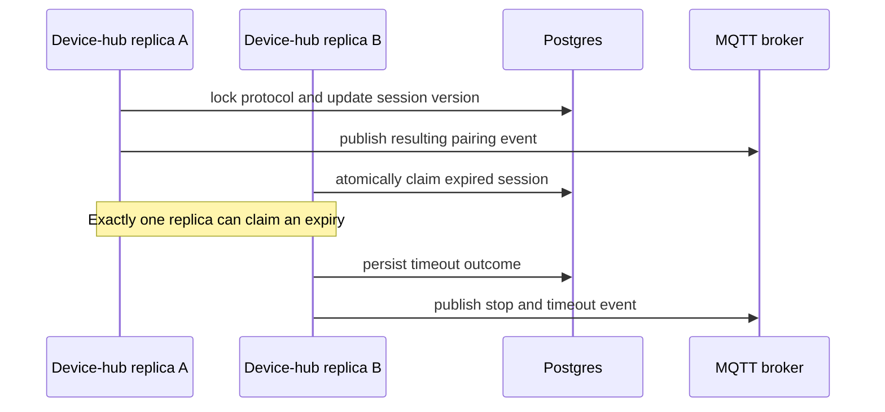

# Core Services Stateless Migration Plan

## Goal

Run every core Homenavi service with more than one replica without losing workflow state, requiring session affinity, or duplicating an externally visible side effect. Process memory may hold only derived, bounded caches that can be discarded at any time.

## Ownership Rules

| State class | Owner | Examples |
|---|---|---|
| Durable domain truth | Postgres | devices, commands, pairing outcomes, workflows, integration installation records |
| Short-lived coordination | Redis | leases, active command/pairing records, replay buffers, locks, TTL-backed availability |
| Derived data | Local memory or Redis cache | workflow definitions, selector results, HTTP response cache |

Every shared-consumer handler must be idempotent. Terminal transitions are written durably before emitting their MQTT or HTTP-visible event.

## Transactional Device-Hub Contract

The device-hub migration uses Postgres for durable command and pairing history plus terminal transitions. Redis coordinates active command correlation and expiry; it is not the source of durable lifecycle history.

- Command rows store both the stable device UUID and canonical `protocol/external_id`, plus a monotonic version and a globally unique correlation ID; Redis holds only the active correlation/device claim until terminal completion or expiry.
- Pairing rows store the complete serializable session snapshot, a monotonic version, and an active/terminal marker.
- A Postgres transaction takes a transaction-scoped advisory lock for the device or protocol, reads the current row, applies one transition, and writes the next version.
- Expiry workers atomically claim rows that are still active and expired. Only the successful update emits the timeout event.
- `hdp_lifecycle_outbox` is reserved for a future durable MQTT publisher. Until that publisher is implemented, lifecycle publication remains direct and retry behavior is provided by MQTT QoS/reconnect handling.

This design provides one durable source of truth, restart recovery, and idempotent duplicate delivery handling without a Redis lease expiring mid-transition.

## Service Status

| Service | Status | Required work |
|---|---|---|
| api-gateway | Stateless | Redis rate limiting is already shared. |
| auth-service | Stateless | Refresh-token state is Redis-backed. |
| user-service | Stateless | Domain state is Postgres-backed. |
| config-service | Stateless | Configuration service has no mutable runtime state. |
| dashboard-service | Stateless | Optional Redis cache is derived data. |
| entity-registry-service | Stateless | Postgres owns entities; cache is derived. |
| history-service | Stateless | Postgres owns append-only history. |
| automation-service | Stateless | Postgres owns workflow/cooldown state; Redis owns run-event replay and selector cache. Per-replica cron reconciliation is safe because durable cooldown claims suppress duplicate runs. |
| device-hub | In progress | Externalize commands and pairing sessions, then move their MQTT streams to a shared group. |
| integration-proxy | Stateless | Postgres owns visible operation status, update state, and per-integration update claims; proxy/manifests are rebuildable routing caches. |

Zigbee and mock adapters are intentionally outside the stateless core-consumer rollout. They remain exclusive singleton bridges because they own adapter-local device transport and pairing lifecycles.

## Device-Hub Phases

1. Adapter availability: Redis TTL snapshots. Implemented.
2. Metadata and removal ingest: idempotent Postgres writes in a shared MQTT group. Implemented.
3. Commands: Postgres command history plus Redis active correlation/device ownership records. Implemented. A Redis reaper claims expired commands; only the claimant emits timeout.
4. Pairing: production start, stop, timeout, progress, and candidate transitions use versioned Postgres protocol transactions. The earlier Redis active-session/lease implementation was removed because it could lose updates after lease expiry. The local pairing map remains only for repository-free unit tests and is not constructed in the production application path.
5. Shared delivery: implemented for every device-hub HDP consumer topic when `DEVICE_HUB_MQTT_SHARED_GROUP` is configured with EMQX. The subscription classification test protects this decision.

## Automation Phase

The durable cooldown claim already prevents duplicate workflow execution. Selector resolution now uses Redis when configured, so replicas reuse the same short-lived ERS result. If cron reconciliation becomes costly at scale, elect a Redis lease holder to reconcile schedules; every runnable schedule still uses the Postgres cooldown claim. Redis run-event lists remain the cross-replica WebSocket transport; Redis Pub/Sub is not used.

## Integration-Proxy Phase

Install/restart operation status persists in PostgreSQL through `integration_operation_statuses`. Update state and atomic per-integration claims persist through `integration_update_statuses`. Keep reverse-proxy, upstream, manifest, and manifest-error maps as rebuildable local routing caches.

## Current Delivery Boundary

Device-hub shares adapter availability, metadata, state, events, command results, and pairing progress when `DEVICE_HUB_MQTT_SHARED_GROUP` is configured. Generic MQTT brokers remain exclusive because shared subscriptions require the EMQX topic strategy.

## Atomic Pairing Session Design

Implementation rules:
- Postgres holds one active serialized session per protocol plus a monotonic version.
- A transaction-scoped advisory lock serializes every start, stop, progress, and candidate mutation for that protocol.
- A terminal transition writes the final snapshot before emitting MQTT.
- Expiry uses a versioned transactional claim. A replica that does not win the update emits nothing.
- Process memory may cache decoded data only inside one mutation; it is never an authority or recovery source.

## Rollout Gates

- Add focused cross-replica tests before changing a topic to shared mode.
- Verify restart recovery for active command and pairing records.
- Keep generic MQTT/Mosquitto in exclusive mode; shared groups require EMQX.
- Scale one service at a time, observe duplicate/error counters, then increase replicas.
