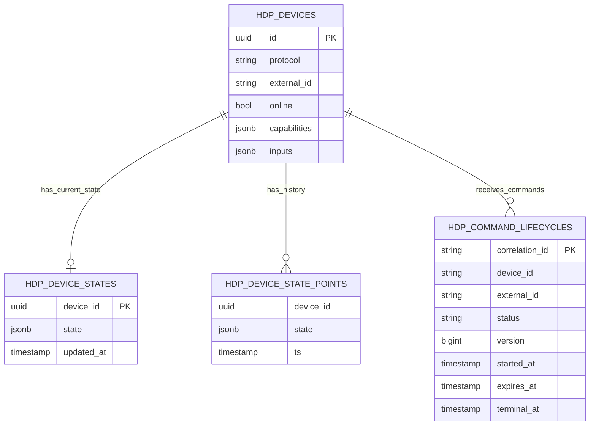
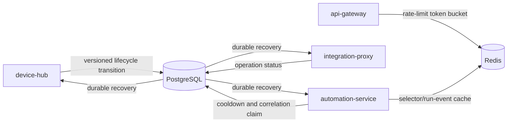

# Database Schema Overview

## Purpose

Homenavi uses PostgreSQL for durable domain state and transactional coordination. Redis is reserved for rate limits, bounded caches, short-lived coordination, and replay buffers; it is not the source of truth for user, device, workflow, or integration data.

Services own their tables. Cross-service consumers use APIs, HDP events, or stable identifiers rather than directly writing another service's tables.

## Core Ownership

| Owner | Table families | Durable responsibility |
|---|---|---|
| Auth and user services | users, roles, sessions, refresh/lockout records | Identity, authorization, and account lifecycle |
| Dashboard service | dashboards, widgets, layouts | User dashboard definitions and layout state |
| Entity Registry Service | ERS device, room, tag, group, and binding tables | Canonical inventory metadata and HDP bindings |
| Device hub | `hdp_devices`, `hdp_device_states`, `hdp_command_lifecycles`, `hdp_pairing_lifecycles`, `hdp_lifecycle_outbox` | Device metadata/state and command/pairing lifecycle coordination |
| History service | `hdp_device_state_points` | Append-oriented historical state points |
| Automation service | workflows, workflow runs/steps, pending correlations, trigger cooldowns | Workflow definitions, execution, command correlation, and idempotency claims |
| Integration proxy | `integration_operation_statuses`, `integration_update_statuses` | Install/restart progress plus update state and atomic update claims across proxy replicas |

The exact GORM model names and migrations are the executable source of truth. This document describes the stable architectural model rather than replacing migrations.

## HDP Device Model

HDP identity is the canonical packed reference `protocol/external_id`. Device-hub stores current normalized state in `hdp_device_states`; history-service appends observations to `hdp_device_state_points`.

## Stateful Operations

### Device Hub Lifecycles

`hdp_command_lifecycles` records a globally correlated command, expected/baseline state, dispatch expiry, terminal status, and version. `hdp_pairing_lifecycles` stores the serialized active pairing session per protocol and a versioned terminal transition. These rows prevent duplicate state transitions across replicas.

`hdp_lifecycle_outbox` is reserved for future durable MQTT-visible lifecycle publication. It is not yet populated or claimed by a publisher worker; current lifecycle events use direct MQTT publication after their durable transition.

### Automation Idempotency

Automation stores workflow definitions and run history in PostgreSQL. `pending_correlations` binds command results to an execution, while `trigger_cooldowns` is an atomic claim that prevents duplicate trigger and schedule execution across replicas.

### Integration Operations

`integration_operation_statuses` stores the latest visible stage, progress, message, and timestamp for install/restart/update operations. `integration_update_statuses` stores marketplace version state, update policy, last check/error, and the `in_progress` claim. The claim changes from false to true atomically, so only one proxy replica performs a given update.

Integration configuration itself remains in the installed-integration configuration file because it is deployment configuration; the database tables make runtime progress and update coordination observable after a proxy restart or on another replica.

## Redis Boundary

Redis keys are intentionally ephemeral. Examples include API gateway rate limits, adapter presence TTL snapshots, selector-resolution cache entries, and bounded automation run-event replay lists. Losing Redis cache data may cause a refetch or temporary rate-limit reset policy, but must not lose domain truth.

## Schema Changes

- Add migrations through the owning service's GORM models/repository.
- Preserve service table ownership; avoid cross-service writes.
- Use explicit version or terminal predicates for shared state machines.
- Test new coordination rows for duplicate delivery, restart recovery, and concurrent claims.
