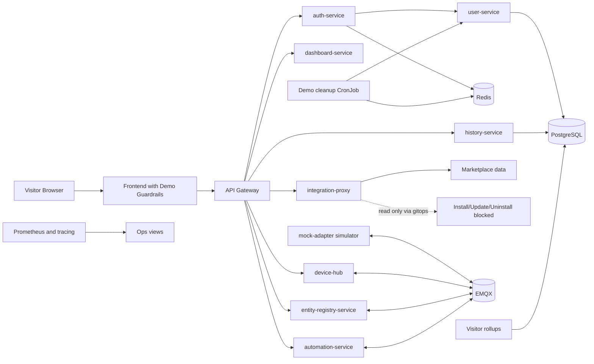
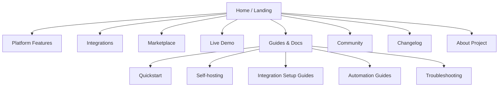

# Homenavi Public Demo Instance Plan v3

## Objective
Build a public Homenavi demo that deploys cleanly on Kubernetes, feels complete on first visit, stays bounded under abuse, and reflects the current platform instead of the older pre-runtime proposal.

The demo should:
- Auto-create or auto-bootstrap a temporary demo identity.
- Land on a polished, already-seeded smart-home view.
- Expose integrations and marketplace content in a safe read-only mode.
- Block destructive and security-sensitive actions in both UI and backend.
- Track active visitors and prune stale demo tenants.
- Reuse the platform work that already exists in the repo today.

---

## What Changed Since v2 Was Written

The original document was added in commit `f224d47`. Since then, the platform changed in important ways that affect the demo plan:

### Already in place now
- Homenavi has a real Kubernetes deployment path via `helm/homenavi`, not just a conceptual one.
- `integration-proxy` is now a first-class runtime with `compose`, `helm`, and `gitops` modes.
- `gitops` mode already enforces read-only behavior for integration mutations, which is directly useful for a public demo.
- The frontend now has a real integrations and marketplace admin surface, reusable integration cards, snackbars, and a stronger visual system.
- `dashboard-service` now stores a richer dashboard document using `layouts_by_cols`, which is a better basis for a curated demo dashboard.
- Core observability and HA deployment work have advanced significantly, so demo operations can build on the current Helm/metrics/tracing model rather than inventing a side path.

### Still not in place yet
- There is no demo identity/session flow in the current auth or user stack.
- There is no explicit demo user metadata or janitor cleanup path.
- The default dashboard is still a generic starter layout, not a demo-specific seeded experience.
- `mock-adapter` is still a placeholder heartbeat/pairing implementation, not a rich household simulator.
- There is no dedicated demo Helm values file, namespace overlay, or demo CronJob yet.

### Practical implication
The updated plan should no longer describe the whole runtime as future work. The runtime, marketplace, dashboard framework, and cluster deployment path already exist. The missing work is specifically the public-demo layer on top of them.

---

## Current-State Snapshot

| Area | Current state in repo | Demo implication |
|---|---|---|
| Kubernetes deployment | Helm chart exists in `helm/homenavi` with real service values and HA validation profiles | Demo should be an overlay, not a parallel deployment model |
| Integration runtime | `integration-proxy` supports `compose`, `helm`, and `gitops` runtime modes | Public demo should use `gitops` to make integration browsing safe by default |
| Marketplace UI | Frontend already has installed/marketplace views and integration cards | Public demo can reuse the current integrations UX with a demo-specific restriction layer |
| Dashboard model | `dashboard-service` has a persisted default dashboard with `layouts_by_cols` and widget catalog support | Curated demo dashboards can extend the existing model rather than invent new storage |
| Frontend styling | The app already has a recognizable slate-and-emerald glass UI system | Demo should preserve that styling so the public experience matches the real product |
| Mock devices | `mock-adapter` is still a placeholder with heartbeat and command hooks | A realistic demo still needs a richer simulator pass |
| Observability | Core services and Helm paths have moved well beyond the old planning stage | Demo operations should use existing health, metrics, and deployment practices |

---

## Recommended Branch And Environment Strategy

Keep the dedicated demo delivery path, but reduce branch-only divergence where possible.

Recommended branch strategy:
- `demo/public-instance` remains the integration branch for the public demo variant.
- Demo-specific behavior should be mostly flag-driven so fixes can flow from `main` without constant cherry-picking.
- The branch should primarily hold demo values, seeded content, and demo UX restrictions, not a forked platform architecture.

Recommended environment split:
- Namespace: `homenavi-demo`
- Public host: `demo.homenavi.org`
- Product site host: `www.homenavi.org`
- Marketplace host remains separate from the live demo runtime

---

## Updated Architecture

---

## Foundations We Should Reuse Instead Of Rebuilding

### 1. Integration read-only mode
This is no longer theoretical. `integration-proxy` already supports `INTEGRATIONS_RUNTIME_MODE=gitops`, and mutation paths are rejected in that mode.

Use that directly for the public demo:
- Visitors can browse installed integrations and marketplace metadata.
- Install, update, uninstall, and restart actions remain visible but unavailable.
- Backend enforcement already has a natural home in `integration-proxy`.

### 2. Existing frontend visual system
The public demo should keep the same brand language as the app:
- Slate/dark layered surfaces from `frontend/src/colors.css`
- Glass panels/cards/pills
- Integration cards and hero-card patterns already used in About and Admin surfaces
- Snackbar-based feedback instead of dead-end disabled UIs

### 3. Current dashboard model
The dashboard no longer needs a schema redesign first.

What exists now:
- `dashboard-service` already provisions a default dashboard if none exists.
- The stored dashboard document already supports responsive layouts by column count.
- Widget catalog merging with integration-provided widgets already exists.

What is still missing for demo use:
- A truly curated seeded dashboard document
- Prewired device/widget settings
- Associated seeded rooms, groups, and automations

### 4. Current Kubernetes and ops path
Use the same Helm baseline, health checks, metrics, and tracing conventions as the main platform.

Do not build a demo deployment with a one-off manifest tree unless it is only a thin overlay.

---

## Gap Analysis By Workstream

### A. Demo identity and session bootstrap
Status: not implemented yet.

Needed:
- A public endpoint or bootstrap path that issues a demo-scoped session without signup.
- A user record marked as demo-owned.
- Local token rotation behavior on reset/logout.

Recommended shape:
- Add a dedicated demo bootstrap endpoint in `auth-service`.
- Persist demo user metadata in `user-service`.
- Keep the frontend bootstrap path isolated behind `VITE_DEMO_MODE=true`.

Recommended demo metadata:
- `is_demo`
- `created_at`
- `demo_expires_at`
- optional `visitor_key_hash`

### B. Activity tracking and cleanup
Status: not implemented yet.

Needed:
- Per-user `last_active_at` stored in Redis.
- Debounced activity writes from authenticated traffic.
- A janitor job that deletes stale demo users and their associated demo-owned data.

Recommended rules:
- Inactivity TTL: 15 minutes
- Hard cap: 1500 live demo users
- Emergency ceiling: 2000 only if aggressive cleanup is active

Recommended cleanup order:
1. Remove demo users whose Redis activity key is older than the inactivity window.
2. If still above the cap, remove the oldest inactive demo users first.
3. Never delete non-demo users.

### C. Curated seeded demo world
Status: partially enabled by the current platform, but not seeded yet.

Platform support already exists for:
- persisted dashboard defaults
- rooms and map metadata
- groups and selectors
- automations and manual triggers
- integration-provided widgets

Still needed:
- a seeded household dataset
- a demo-specific default dashboard document
- device/widget bindings that look meaningful on first load

Suggested seeded entities:
- Rooms: living room, kitchen, bedroom, hallway, patio
- Groups: lights, climate, security, media
- Automations: morning warmup, away mode, evening scene, motion hallway lights
- Devices: thermostat, dimmer, lock, plug, smart bulb, motion sensor, contact sensor, fan

### D. Read-only guardrails
Status: integration runtime path already exists; broader demo policy still missing.

Keep visible:
- integration detail pages
- marketplace views
- add-device and device-detail surfaces
- account/settings views where browsing still teaches the product

Block mutations in both frontend and backend:
- add/delete device
- password changes
- 2FA enablement
- integration install/update/uninstall/restart
- destructive automation or inventory admin actions unless explicitly allowed for the demo script

Feedback pattern:
- keep the panel open
- disable the final mutation control
- show a branded snackbar
- optionally show inline helper text

Suggested copy:
- "Unavailable in public demo"
- "This action is disabled in the live demo environment"
- "Browsing is enabled here, but changes are blocked"

### E. Simulator depth
Status: not implemented yet.

Current state:
- `mock-adapter` publishes adapter presence and handles command/pairing hooks.
- It is still explicitly a placeholder, not a rich smart-home simulation.

Needed:
- device personas with stable identities
- timed state changes
- scene transitions that demonstrate automations
- plausible telemetry for dashboard widgets and charts

Suggested scene loops:
- Morning: thermostat ramps, kitchen plug turns on, hallway motion clears
- Leaving home: all lights off, lock engaged, occupancy false
- Evening: living room warm light, media group active, patio light on

---

## Current Touchpoints

Use these files as the primary implementation anchors:

- `dashboard-service/internal/dashboard/service.go`
  Current default dashboard provisioning and widget catalog merge.
- `dashboard-service/internal/dashboard/types.go`
  Current `layouts_by_cols` document model used for seeded defaults.
- `integration-proxy/internal/http/runtime_modes.go`
  Current runtime-mode handling and `gitops` read-only enforcement.
- `frontend/src/components/Admin/IntegrationsAdmin.jsx`
  Current marketplace and installed integrations UX surface.
- `frontend/src/components/common/IntegrationCard/IntegrationCard.css`
  Reusable visual pattern for public-facing integration surfaces.
- `frontend/src/components/About/About.css`
  Best current example of a polished Homenavi marketing-style card/hero treatment.
- `frontend/src/colors.css`
  Shared color and surface tokens that the demo and website should continue using.
- `mock-adapter/internal/adapter/service.go`
  Current placeholder adapter that must evolve into the demo simulator.
- `helm/homenavi/values.yaml`
  Current baseline Helm service configuration.
- `helm/homenavi/templates/integration-proxy-config.yaml`
  Current integration-proxy bootstrap configuration path.

---

## Revised Kubernetes Plan

This should now be implemented as a Helm overlay, not as a fresh deployment concept.

### Demo values file
Add a dedicated values file such as `helm/homenavi/values-demo.yaml` with at least:
- `DEMO_MODE=true`
- `VITE_DEMO_MODE=true`
- `INTEGRATIONS_RUNTIME_MODE=gitops`
- `DEMO_USER_TTL_MINUTES=15`
- `DEMO_USER_HARD_CAP=1500`
- `DEMO_ACTIVITY_WRITE_DEBOUNCE_SECONDS=60`
- simulator-specific flags for the richer mock household

### Kubernetes objects to add or override
- namespace-specific values overlay
- public demo ingress
- demo janitor CronJob
- optional analytics rollup CronJob
- config/secret entries for demo feature flags

### Operational guidance
- Keep the demo environment isolated by namespace, host, and values.
- Prefer shared base charts with demo-only overrides.
- Make reseeding and cleanup safe to rerun.

---

## Acceptance Criteria

- First visit creates or restores a demo session automatically.
- The first dashboard looks intentionally configured, not blank.
- Devices, groups, map data, and automations are already present.
- Integration marketplace browsing works, but mutations are blocked.
- Authenticated API activity updates demo presence in Redis.
- Janitor cleanup removes stale demo users and enforces the hard cap.
- The frontend explains blocked actions clearly with branded feedback.
- Demo deployment uses the existing Helm path plus a demo overlay.

---

## Recommended Execution Order

1. Add demo bootstrap/session support in auth-service and user-service.
2. Add Redis activity tracking and janitor cleanup.
3. Create the seeded demo dataset and curated dashboard document.
4. Expand `mock-adapter` into a meaningful simulator.
5. Add frontend read-only guardrails and snackbar messaging.
6. Add `values-demo.yaml`, ingress, and CronJobs for Kubernetes.
7. Add lightweight demo analytics and internal reporting.

---

## Short Conclusion

The old document treated nearly everything as future work. That is no longer accurate.

Today, Homenavi already has the runtime, marketplace surfaces, dashboard persistence model, frontend visual language, and Kubernetes baseline needed for a public demo. The remaining task is to build a thin but deliberate public-demo layer: demo identity, bounded retention, seeded content, richer simulated devices, and explicit read-only policy.

*** Add File: /home/adam/Projects/homenavi-website/website-product-plan.md
# Homenavi Website Product Plan

## Objective
Build a real product website for Homenavi at `www.homenavi.org` that feels like the public face of the platform rather than a repackaged app shell.

The site should:
- Reuse most of the current Homenavi visual language.
- Introduce a strong landing page with clear product positioning.
- Offer a prominent entry point to the live demo instance.
- Showcase integrations and marketplace content.
- Provide guides, onboarding, and support content for real users.
- Give Homenavi a credible product narrative for visitors who are not yet ready to self-host.

---

## Current Starting Point

The target repo `/home/adam/Projects/homenavi-website` is effectively empty today.

That means this project should start as a clean website build, but it should not invent a new visual identity. The current app already provides strong inputs that should be reused:

- color tokens and gradients from `frontend/src/colors.css`
- glass-card and pill treatment from the main app
- integration card patterns from the current marketplace/admin UI
- hero-card treatment from the About page
- product feature language from the main `README.md`

---

## Product Positioning

The website should answer three visitor questions quickly:

1. What is Homenavi?
2. Why would I use it instead of a closed smart-home stack?
3. How do I try it right now?

Recommended positioning:
- Open smart-home platform
- Integration-first architecture
- Realtime dashboard, automation, and device inventory in one system
- Self-hostable, but approachable
- Extensible for both users and integration developers

Tone:
- technical but welcoming
- product-focused, not academic
- confident without overselling maturity

---

## Design Direction

### Visual reuse from the current app
Preserve these brand anchors:
- deep slate backgrounds
- emerald primary accent
- translucent glass surfaces
- rounded cards and pill navigation
- bold, clean product headings

### What should change for the website
The website needs more breathing room and stronger editorial layout than the application shell.

Recommended website-specific adjustments:
- larger hero typography
- wider content rhythm and section spacing
- more screenshot-led storytelling
- cleaner content columns for docs and guides
- more contrast between marketing content and app UI screenshots

### Design rule
The website should look like it belongs to the same product family as the app, but it should not feel like the dashboard copied into a homepage.

---

## Site Map

---

## Core Pages

### 1. Home / landing page
Purpose:
- establish the product story
- show the product visually
- route visitors to the right next step

Recommended sections:
- Hero with headline, short subcopy, and two primary CTAs
- Screenshot or short product montage
- Core value strip: devices, automations, dashboards, integrations
- Architecture/value section for power users
- Marketplace spotlight section
- Demo teaser section
- Quickstart section for self-hosters
- Social proof or project trust signals
- Footer with docs, GitHub, Discord, demo, marketplace

Primary CTAs:
- `Try live demo`
- `Self-host Homenavi`

Secondary CTAs:
- `Browse integrations`
- `Read the guides`

### 2. Features page
Focus on the major product pillars:
- realtime devices
- dashboards and widgets
- inventory and map
- automation engine
- integrations runtime
- observability and deployment path

This should use screenshots and short diagrams rather than only text.

### 3. Integrations page
Purpose:
- explain how integrations work
- show available categories and examples
- route users to install docs and marketplace entries

Recommended sections:
- verified integrations
- community integrations
- integration developer path
- runtime modes and deployment expectations

### 4. Marketplace page
Purpose:
- expose the Homenavi integration catalog in a product-friendly way
- support search/filter/badges
- link to detailed integration pages

Recommended behavior:
- fetch or prebuild from marketplace API metadata
- surface verified, featured, and trending integrations
- show version, publisher, capabilities, and screenshots
- provide install docs link rather than in-browser install for the product site

### 5. Demo page
Purpose:
- set expectations for the live demo
- explain what is interactive and what is read-only
- provide direct entry to `demo.homenavi.org`

Recommended sections:
- live demo CTA block
- what you can explore
- what is intentionally disabled
- note about temporary demo sessions
- fallback path if the demo is temporarily offline

### 6. Guides and docs
Purpose:
- support users after discovery
- reduce GitHub README overload
- turn product interest into successful usage

Recommended guide structure:
- Quickstart
- Local Docker setup
- Kubernetes install
- Device and map setup
- Dashboard customization
- Automation basics
- Integrations install and update flow
- Troubleshooting and FAQ

### 7. Community / about
Purpose:
- explain project background
- link to GitHub, issues, Discord, and roadmap
- humanize the product without turning the page into a personal blog

### 8. Changelog
Purpose:
- show project momentum
- surface releases and notable features
- improve trust for evaluators

---

## Landing Page Content Plan

### Hero
Draft direction:
- Headline: `Your smart home, on your terms.`
- Supporting copy: `Homenavi combines realtime device control, dashboards, automation, and an integration marketplace in one self-hostable platform.`

Hero CTAs:
- `Try the live demo`
- `View deployment guide`

Hero media:
- main dashboard screenshot
- optional subtle animated highlight overlays

### Value blocks
Recommended four-block structure:
- Realtime control
- Visual dashboards
- Automation workflows
- Integration marketplace

### Proof section
Use concise facts drawn from the current platform:
- microservice architecture
- MQTT/HDP realtime plane
- Docker and Kubernetes deployment paths
- integration runtime with marketplace model

### Demo strip
The landing page should include a clear callout for the public demo:
- direct demo link
- note that no setup is required
- note that some actions are disabled in the demo

### Self-hosting strip
For users ready to install:
- Docker Compose quickstart
- Helm/Kubernetes path
- links to more detailed guides

---

## Design System Reuse Plan

Use the current app as the starting source of truth.

### Reuse immediately
- color tokens from `frontend/src/colors.css`
- card surfaces inspired by `GlassCard`
- pill navigation inspired by `GlassPill`
- section headers inspired by `PageHeader`
- integration visual treatment inspired by `IntegrationCard`

### Adapt for the website
- create page-width containers and a spacing scale suited to editorial layouts
- build a marketing hero variant of the glass card
- define a screenshot frame component
- define a docs article layout component

### Suggested rule for reuse
Copy the visual primitives first. Only extract a shared package later if both repos start changing those primitives in parallel often enough to justify it.

---

## Technical Architecture Recommendation

Use a framework optimized for marketing, docs, and SEO rather than duplicating the application shell.

Recommended stack:
- Next.js with App Router
- React
- TypeScript
- MDX for guides and long-form docs
- static generation for most marketing pages
- server-side or build-time fetches for marketplace content

Why this fits:
- SEO matters for the public website
- content pages and guides benefit from MDX
- screenshot-heavy landing pages benefit from image optimization
- React makes reuse of component ideas from the main app straightforward

If strict stack reuse matters more than SEO convenience, Vite + React is still viable, but the default recommendation for the website is Next.js.

---

## Data And Content Sources

### Content managed in the website repo
- landing page copy
- feature descriptions
- guides and FAQs
- community/about content
- changelog summaries

### Content sourced from existing Homenavi systems
- integration catalog metadata from marketplace APIs
- screenshots from the main app
- release/version metadata from GitHub releases or repo tags
- selected architecture facts from the main repo docs

### Synchronization rule
Do not make the product website depend on the application being online for basic rendering. Prefer build-time fetch and cache for marketplace content, with graceful fallback if the API is unavailable.

---

## Demo Integration On The Website

The demo link should be treated as a primary product action, not buried in docs.

Recommended placements:
- hero CTA on the home page
- persistent top-nav link
- dedicated demo page
- footer CTA

Recommended behavior:
- if the demo is healthy, route directly to `demo.homenavi.org`
- if degraded, show a lightweight status note and alternative screenshot/video content

Recommended copy constraints:
- explain that the demo is temporary
- explain that some sensitive actions are intentionally disabled
- keep the promise clear: visitors can explore without setup

---

## Guides And User Support Plan

The website should become the user-facing home for practical guidance, not just a marketing shell.

### Minimum guide set
- Getting started
- Install with Docker Compose
- Install with Helm
- Add and manage devices
- Configure dashboards
- Build automations
- Browse and install integrations
- Troubleshooting
- FAQ

### Documentation style
- short pages with real screenshots
- explicit prerequisites
- clear command blocks
- cross-links between concept and task pages

### Support surfaces
- searchable guides index
- version-aware docs if releases stabilize further
- community links to GitHub and Discord

---

## Marketplace And Integration Features For The Site

This should be more than a static list.

Recommended marketplace experience:
- searchable grid of integrations
- featured and verified badges
- publisher details
- screenshots and descriptions
- capability tags such as widgets, automations, device support, setup UI
- direct links to install/setup docs

Recommended integration detail page structure:
- overview
- screenshots
- capabilities
- requirements
- install path
- setup path
- troubleshooting links

This gives the website real product depth without mixing it up with the app's in-cluster installation workflow.

---

## Delivery Plan

### Phase 1: Foundation
- initialize the website project
- import the current visual tokens and core UI primitives
- build layout, nav, footer, and content scaffolding

### Phase 2: Marketing surface
- build landing page
- add features page
- add demo page and CTA routing

### Phase 3: Content and support
- add guides/docs section with MDX
- migrate core user-facing setup content from the main repo docs into website-friendly guides

### Phase 4: Marketplace experience
- add marketplace listing and integration detail pages
- wire build-time data fetching and caching

### Phase 5: Polish and launch
- responsive QA
- SEO metadata
- analytics
- accessibility pass
- deploy to `www.homenavi.org`

---

## Success Criteria

- Visitors understand what Homenavi is within one screen.
- The landing page presents both a product story and a working next step.
- The live demo is easy to find and clearly explained.
- Integrations and marketplace content feel like a first-class part of the product.
- Users can find practical setup guides without being dropped straight into raw repo docs.
- The visual language feels recognizably Homenavi, not like a separate product.

---

## Recommendation

Build the website as a proper product surface with three equal priorities:
- product narrative
- live demo entry
- practical user guidance

The current app already contains the visual DNA needed to make this site feel coherent. The website should reuse that DNA, widen it into a more editorial layout, and turn Homenavi from a repo-first project into a product people can understand, try, and adopt.
