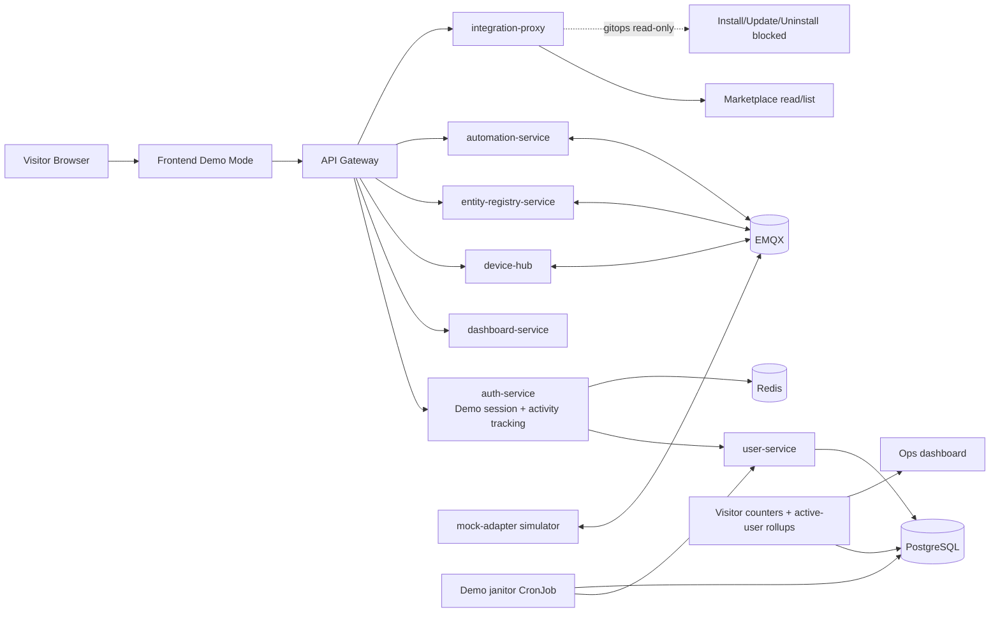

# Homenavi Public Demo Instance Plan v2

## Objective
Build a Kubernetes-deployed public demo that feels finished on first visit, stays safe under abuse, and does not require visitors to configure anything before they see value.

The demo should:
- Auto-create a demo user on first visit.
- Show a polished, already-configured dashboard immediately.
- Include preconfigured devices, rooms/map, groups, and automations.
- Keep integrations browseable but read-only.
- Block sensitive actions while keeping the UX smooth.
- Track demo usage and retain only recent active visitors.
- Run on its own branch and deploy cleanly to Kubernetes.

---

## Recommended branch strategy

Use a dedicated branch for the demo variant:
- `demo/public-instance`

Suggested release flow:
- Develop demo features only on the demo branch.
- Deploy the demo branch to a dedicated Kubernetes namespace.
- Tag demo releases separately from mainline releases.

---

## Short answer on server capacity

For an i5-6500, 16 GB DDR4, and M.2 SSD:
- 1000-2000 total demo visitor records is realistic if the system is cleaning up inactive users and the workload is mostly cached/read-heavy.
- 1000-2000 concurrent active visitors is not a safe assumption.
- A more realistic target is 100-300 active visitors with modest real-time activity, assuming the demo devices are simulated and the database write rate is controlled.

What is likely to matter most:
- PostgreSQL write churn from activity tracking.
- MQTT/event fan-out from simulated devices.
- Frontend/API cache effectiveness.
- The number of active dashboards polling live data.

Practical cap recommendation:
- Set the demo hard cap around 1500 total live demo users.
- Keep active sessions bounded with a 15-minute inactivity window.
- If you want extra headroom, allow 2000 total records only when the janitor is aggressively pruning older inactive demo users.

The M.2 SSD is fine. The limiting factors are more likely to be RAM and service chatter than storage speed.

---

## Updated architecture

---

## Design pillars

### 1. First visit must feel prebuilt
The demo should not look like a clean installation. It should look like someone already set up a functional smart-home environment.

That means the first screen should already contain:
- A polished dashboard with meaningful widgets.
- Rooms and a visual map with labeled zones.
- Device tiles showing live states.
- Groups and automations already populated.
- One or two obvious “wow” interactions that visitors can try instantly.

### 2. Demo users should be temporary but not too temporary
Visitors should not need accounts, but the system still needs a stable identity to keep state during a session.

The demo flow should use:
- One demo user per visitor session.
- A `last_active_at` value updated from authenticated API traffic and kept in Redis.

For lower database load, the hot interaction timestamp should live in Redis only.
PostgreSQL should store durable creation metadata and optional rollups, not a write on every request.

The simplest useful metric is:
- one row per created demo user with `created_at`
- one Redis-backed `last_active_at` value updated from authenticated API traffic

That is enough to report:
- unique visitors overall
- unique visitors per hour/day/week/month
- currently active visitors in the last 15 minutes
- churn and retention curves

---

## Core behavior changes

### A. Auto-create demo accounts on visit

- Mark the user as demo-only.
- Store `created_at` and an expiration timestamp in PostgreSQL.
- Keep `last_active_at` in Redis as the live source of truth for cleanup.
- If desired, snapshot the Redis state into PostgreSQL on a slower cadence for reporting.
- Do not show signup/login flows in the public demo.

Add a small activity update path that records the most recent authenticated API call for the current JWT user.

Recommended approach:
- On authenticated requests, update `last_active_at` in Redis only.
- Give the Redis key a TTL slightly longer than the inactivity window.
- A 1-2 minute debounce window is enough if you want to reduce Redis churn further.

Best implementation shape:
- API gateway or auth middleware captures the active user ID from the JWT.
- Emit the activity update to a Redis key such as `demo:last_active:<user_id>`.
- Optionally batch-flush summaries to PostgreSQL every few minutes if you want trend charts.

Why this is better than only using creation time:
- A visitor who keeps the site open should not be purged while active.
- It gives you accurate "currently active" and "recent visitor" reporting.

1. Delete the current demo user.
2. Clear local tokens and app state.
3. Create a fresh demo session.
4. Reload the app into a clean demo state.

If deletion fails:
- Still clear local state and create a fresh demo session.

This keeps the demo feeling endless and avoids sticky broken states.

---

## Cleanup and retention plan

### Demo user fields
Add explicit demo metadata in the user store:
- `is_demo`
- `created_at`
- `demo_expires_at`
- optional `visitor_key_hash` if you want a repeat-visitor correlation without storing raw browser identifiers

Redis hot state:
- Keep `last_active_at` in Redis as the live source of truth for cleanup.
- If desired, snapshot the Redis state into PostgreSQL on a slower cadence for reporting.

### Cleanup rules
Use both of these rules:
- Inactivity rule: delete demo users inactive for more than 15 minutes.
- Capacity rule: keep the total live demo user count under the hard cap.

Recommended limits:
- Inactive TTL: 15 minutes.
- Hard cap: 1500 live demo users.
- Upper ceiling only if necessary: 2000 live demo users.

How to interpret the cap:
- This is the maximum retained demo-user population, not a concurrency target.
- If your demo is popular, older inactive users should be pruned first.

Janitor algorithm:
- Prefer deleting users where the Redis `last_active_at` is older than 15 minutes.
- If count is still above the cap, delete the oldest inactive demo users until you are back under the limit.
- Never delete non-demo users.

### Practical caution
Because the demo should feel persistent, do not use creation time alone.
Use `last_active_at` as the primary deletion gate.

---

## Default dashboard and preconfigured demo world

### Dashboard goal
Make the dashboard look alive, polished, and already tuned.

It should not resemble a starter template or blank home screen.

### Recommended first-load layout
Use a curated dashboard with these sections:
- Hero status strip: home mode, occupancy, alarm status, weather, energy snapshot.
- Room/device panel: kitchen, living room, bedroom, hallway.
- Live devices section: lights, sensor, climate, lock, plug.
- Map or floorplan: labeled zones with device markers.
- Automation card area: active routines and scheduled scenes.
- Activity timeline: recent motion, temperature, and command events.
- Quick actions: evening mode, all-off, movie mode, away mode.

### Default content to seed
Add these demo entities on first boot:
- rooms / zones
- groups
- automations
- devices
- dashboard widgets

Suggested demo entities:
- Rooms: living room, kitchen, bedroom, hallway, patio.
- Groups: lights, climate, security, media.
- Automations: good morning, away mode, evening scene, motion hallway lights.
- Devices: smart bulb, dimmer, thermostat, contact sensor, motion sensor, plug, door lock, fan.

### Implementation target
The clean-install default dashboard should be replaced with a curated seeded layout in the demo variant.

Touchpoints:
- [dashboard-service/internal/dashboard/service.go](dashboard-service/internal/dashboard/service.go)
- [dashboard-service/internal/http/dashboard_handler.go](dashboard-service/internal/http/dashboard_handler.go)

### Suggested UX polish
- Use a few high-contrast widgets at the top.
- Preconfigure meaningful labels and icons.
- Ensure the first screen has live data without requiring a setup step.

---

## Device, map, group, and automation seeding

The demo should boot with a complete miniature household.

### Seed plan
- Device registry should include a fixed baseline set of demo devices.
- Map should already show rooms and the devices placed into them.
- Groups should already exist and match the visual layout.
- Automations should already be connected to the demo devices.

### Suggested runtime behavior
- Device state changes should be driven by a simulator.
- Automations should visibly fire in response to those states.
- The map should reflect device state and presence in real time.

### Suggested demo scenes
- Morning: lights on, coffee plug on, temperature rising.
- Leaving home: doors locked, lights off, security on.
- Evening: warm lights, music scene, occupancy in living room.

---

## UI restrictions and snackbar behavior

### Keep the UI usable
Do not hide the UI completely for disabled flows.

Keep these elements visible:
- Add device modal
- Device details screen
- Integration detail screens
- Settings popovers
- Admin pages where read-only browsing makes sense

### Disable action buttons
Disable the action that would actually mutate the system:
- add device
- delete device
- change password
- enable 2FA
- install integration
- uninstall integration
- update integration
- restart integration

### User feedback pattern
When a user clicks a blocked action:
- keep the modal/panel open
- disable the confirm action
- show a snackbar with a short explanation
- optionally show inline helper text under the disabled control

Example text:
- "Unavailable in demo version"
- "This action is disabled in the public demo"
- "You can browse this screen, but changes are not allowed"

### Styling suggestion
Use a distinct disabled state rather than the default gray-only browser look.
The goal is to make the restriction feel intentional and branded, not broken.

---

## Analytics and visitor counting

### Minimum viable visitor tracking
The simplest and most robust metric source is new demo-user creation.

Store:
- created timestamp
- last active timestamp in Redis
- optional session metadata like user agent bucket or coarse region if you need it

That gives you the visitor counts you asked for without adding complicated tracking.

### Useful dashboards
Expose an internal admin view or metrics dashboard with:
- total demo users created
- demo users created in the last hour
- demo users created in the last 24 hours
- demo users created in the last 7 days
- active demo users in the last 15 minutes
- deleted demo users per janitor run
- current total live demo users

### Recommended schema shape
You can implement this in either the user table or a separate analytics table.

Best practical option:
- Keep user identity fields on the user row.
- Add a tiny event/rollup table for daily counts if you want trend charts.
- Keep real-time interaction timestamps in Redis so the database only stores durable summaries.

### Privacy note
You do not need to store precise personal identity for visitor analytics.
Demo-session identity plus timestamps is enough.

---

## Kubernetes deployment plan

This demo variant should target Kubernetes first, not Docker Compose.

### Recommended Kubernetes layout
- Dedicated namespace: `homenavi-demo`
- Dedicated Helm values file: `values-demo.yaml`
- Demo-only CronJob for janitor cleanup
- Optional CronJob for daily analytics rollups
- Separate Ingress host for the public demo

### Demo-specific configuration
Set these kinds of runtime flags in the demo values file:
- `DEMO_MODE=true`
- `VITE_DEMO_MODE=true`
- `INTEGRATIONS_RUNTIME_MODE=gitops`
- `DEMO_USER_TTL_MINUTES=15`
- `DEMO_USER_HARD_CAP=1500`
- `DEMO_ACTIVITY_WRITE_DEBOUNCE_SECONDS=60`
- `MOCK_ADAPTER_SIM_MODE=rich`
- `MOCK_ADAPTER_DEVICE_COUNT=<seeded count>`

### Kubernetes objects to add or override
- Deployment/StatefulSet overrides for demo mode
- CronJob for janitor cleanup
- CronJob for metrics rollup if you want long-term visitor stats
- Secret/config map for demo-specific flags
- Ingress and certificate config for the demo host

### Operational recommendation
Keep demo state in the same databases as the platform if needed, but isolate the demo namespace and flag set so it is easy to reset without touching production-like environments.

---

## Implementation plan

### Phase 1: Demo identity and activity tracking
- Add public demo session creation.
- Add last-active tracking for authenticated requests.
- Add demo logout rotation.
- Add hard-block policy for sensitive auth actions.

### Phase 2: Rich seeded world
- Replace the default dashboard with a curated demo layout.
- Seed rooms, map, groups, devices, and automations.
- Make the first screen feel already configured.

### Phase 3: Simulator and UI polish
- Expand mock-adapter into a real demo simulator.
- Add snackbar messaging and disabled-action styling.
- Keep popups/screens available but read-only for blocked flows.

### Phase 4: Cleanup and analytics
- Add janitor cleanup using Redis `last_active_at`.
- Add hard-cap enforcement.
- Add visitor count rollups and simple admin reporting.

### Phase 5: Kubernetes packaging
- Add demo Helm values.
- Add demo namespace, ingress, and CronJobs.
- Add operational runbook for reset/reseed.

---

## Suggested service-level ownership
- auth-service: demo session, logout rotation, activity tracking hooks, demo-only auth guards.
- user-service: demo user metadata, janitor cleanup, visitor metrics source.
- dashboard-service: curated seeded dashboard and default layout.
- device-hub / entity-registry-service / automation-service: demo world bootstrap and safe read/write policy.
- mock-adapter: rich simulated devices and automations.
- integration-proxy: read-only marketplace mode via gitops.
- frontend: demo bootstrap, snackbar behavior, disabled-action styling, no-account UX.
- Kubernetes manifests: demo namespace, cronjobs, values file, ingress.

---

## Acceptance criteria
- First visit creates a demo user automatically.
- Dashboard immediately looks configured and interesting.
- Devices, groups, map, and automations are already present.
- The app records last active API usage for each demo visitor.
- The janitor keeps only active or recently active demo users.
- The system remains bounded at roughly 1500 live demo users, with 2000 as a ceiling only if needed.
- Blocked actions stay visible but clearly unavailable in the demo.
- Snackbar feedback explains why an action is disabled.
- Visitor counts can be reported overall and by timeframe.
- Integration marketplace remains visible, but install/update/uninstall/restart are blocked.
- The whole demo ships from a dedicated Kubernetes-oriented branch and values set.

---

## Risk register

| Risk | Impact | Mitigation |
|---|---|---|
| Too many active demo visitors | DB and API pressure | 15-minute inactivity cleanup + hard cap + write debounce |
| Users get deleted while still browsing | Bad UX | Track `last_active_at` from authenticated API calls |
| Dashboard still feels too plain | Visitors leave quickly | Seed a curated layout with live device state and quick actions |
| UI restrictions are bypassed via API | Security/demo integrity | Enforce restrictions in backend, not just the frontend |
| Analytics become expensive | Resource waste | Use user creation timestamps plus small rollups only |
| K8s deployment is hard to reset | Ops friction | Separate namespace, demo-only values, and clean CronJobs |

---

## What I would build first

If this were the implementation order, I would do it like this:
1. Demo session endpoint + demo-only auth bootstrap.
2. `last_active_at` tracking and janitor cleanup.
3. Curated seeded dashboard, devices, groups, map, and automations.
4. Mock-adapter simulator improvements.
5. Frontend disabled-action snackbar and styling.
6. Kubernetes demo values, namespace, ingress, and CronJobs.
7. Visitor analytics reporting view.
