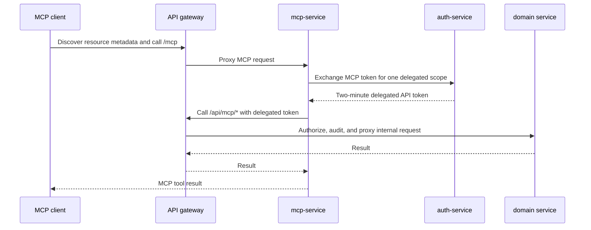

# Homenavi MCP

Homenavi exposes a scoped Streamable HTTP MCP endpoint at `/mcp`. It is a protected OAuth resource; clients discover it from `/.well-known/oauth-protected-resource` and use Authorization Code with PKCE S256.

## Authentication and Consent

MCP access uses dynamically registered public clients with validated HTTPS or loopback redirects. Only resident and admin users can authorize an MCP connection. Access tokens are audience-bound to `/mcp`, signed with RS256, scoped, session-bound, and valid for one hour. Browser application sessions use HttpOnly, Secure (on HTTPS), SameSite=Strict access and refresh cookies; browser JavaScript never receives bearer or refresh credentials.

When the browser already has a valid Homenavi web session, the authorization page opens directly at the consent view. A missing or expired web session requires normal Homenavi sign-in and any configured 2FA challenge. Consent grants are bound to the client, resource, and requested scopes, expire after 30 days, and can be revoked through `DELETE /api/auth/oauth/consents/{clientID}` with the user's API bearer token.

### Connection Policy

`POST /api/auth/oauth/register` dynamically registers public MCP clients. Redirect URIs must be HTTPS or loopback HTTP; HTTPS URIs are matched exactly and loopback clients may use an ephemeral port. The authorization-server metadata at `/.well-known/oauth-authorization-server/api/auth` advertises the registration, authorization, token, and JWKS endpoints. Residents and admins use the same tool policy: a tool is available only when its OAuth scope is granted. An admin role does not silently expand the consented scope set. See [Connect an MCP Client](mcp_connection.md) for client setup and redirect requirements.

The OAuth resource is the public `/mcp` URL and is the audience of an MCP access token. When `MCP_RESOURCE_URI` is unset, mcp-service derives that URL from the request's public host and forwarded scheme. This lets Compose and Helm work without MCP-specific host configuration while keeping consent and token audiences bound to the actual public endpoint.

## Tool Surface

Tools are advertised only when their OAuth scope is granted and the optional `MCP_ENABLED_TOOLS` allowlist permits them.

| Scope | Tools |
| --- | --- |
| `home.devices.read` | `list_devices`, `get_device`, `get_device_state`, `list_device_integrations`, `list_pairings`; with `home.inventory.read`: `get_device_group_state` |
| `home.devices.write` | `send_device_command`; with `home.inventory.read`: `send_device_group_command` |
| `home.inventory.read` | `list_rooms`, `list_device_groups`, `get_device_group`; with `home.devices.read`: `get_device_group_state`; with `home.devices.write`: `send_device_group_command` |
| `home.inventory.write` | `create_device_group` |
| `home.history.read` | `query_state_history` |
| `home.automation.read` | `list_automation_workflows`, `get_automation_workflow` |
| `home.automation.execute` | `run_automation_workflow` |
| Any authenticated MCP session | `describe_homenavi_api`, `list_event_channels`, `get_write_policy` |

Write tools are deliberately narrow. Each requires an `idempotency_key` of at least eight characters and is available only to resident or admin MCP tokens. Device commands additionally require an online device and reuse device-hub's persisted correlation lifecycle and capability validation. Group creation and workflow runs persist their idempotency keys and replay the original result on retry. Before invoking a domain tool, mcp-service exchanges the MCP token for a two-minute delegated token with the API-gateway audience and only the required scope. All MCP device, inventory, history, and automation operations pass through dedicated gateway routes; automation-service additionally validates the delegated token it receives. No separate browser confirmation is required after OAuth consent.

Pairing, automation editing, dashboard changes, and user changes remain unavailable through MCP.

The original MCP bearer token is never forwarded to internal domain services. Auth-service is the only direct MCP dependency and is used solely for OAuth and token exchange.

## Delegated Gateway Routes

MCP domain operations are not a general external REST API. mcp-service is their only caller and obtains a distinct two-minute token with `typ=homenavi-delegated`, the API-gateway audience, and exactly one requested scope. The gateway rejects raw MCP tokens, browser API tokens, expired or revoked sessions, non-resident roles, and missing scopes. The requested delegated scope must already be present on the MCP token.

| MCP capability | Gateway route | Delegated scope |
| --- | --- | --- |
| Device, integration, and pairing reads | `GET /api/mcp/hdp/devices*`, `/integrations`, `/pairings` | `home.devices.read` |
| Rooms and device-group reads | `GET /api/mcp/ers/rooms/`, `/groups/*` | `home.inventory.read` |
| Device-group state | Device-group read plus device reads | `home.inventory.read` and `home.devices.read` |
| Historical state | `GET /api/mcp/history/state` | `home.history.read` |
| Device command and online-target preflight | `GET /api/mcp/hdp/device-command-targets/*`; `POST|PATCH /api/mcp/hdp/devices/*/commands` | `home.devices.write` |
| Device-group command | Group read plus device command | `home.inventory.read` and `home.devices.write` |
| Group creation | `POST /api/mcp/ers/group-creates` | `home.inventory.write` |
| Workflow reads | `GET /api/mcp/automation/workflows*` | `home.automation.read` |
| Workflow run | `POST /api/mcp/automation/workflows/*/run` | `home.automation.execute` |

For the full trust-boundary diagram and token contract, see [MCP Gateway Delegation Plan](mcp_gateway_delegation_plan.md).

## Planned Account Connection Removal

MCP access should be removed from an account-level **Connected applications** section in User Settings rather than from individual device or automation screens. The implementation plan is:

1. Add an authenticated endpoint that lists consented OAuth clients with client identifier, granted scopes, creation time, and most recent activity; do not expose client secrets or bearer tokens.
2. Add a per-client **Remove access** action that calls the existing consent-revocation endpoint and revokes all active MCP sessions/tokens issued for that user-client pair.
3. Require a confirmation dialog that identifies the client and its granted scopes. Removing access must terminate future tool calls immediately, while preserving only non-sensitive audit metadata.
4. Add a dedicated MCP connection card to User Settings after the API is available. It should show an empty state when no MCP clients are authorized and must not provide a direct token-management UI.
5. Add API, reducer, and component tests for listing, revoking, immediate session invalidation, and the empty/error states. Document the behavior in the account security help text.

## Operations

Set `MCP_ENABLED=false` to disable MCP entirely. `MCP_RATE_LIMIT_PER_MINUTE` sets the per-session request ceiling; the production limiter is Redis-backed. With an empty `MCP_RESOURCE_URI`, MCP derives its public resource from the request host and forwarded scheme, so Compose and Helm need no MCP-specific resource setup. Set `MCP_RESOURCE_URI` only when MCP uses a distinct public gateway URL. `API_GATEWAY_URL` defaults to `http://api-gateway:8080` and is used for delegated MCP operations. Successful MCP requests emit structured logs with the authenticated subject, client ID, request ID, JSON-RPC method, called tool name when applicable, and response status. Request arguments and returned data are not logged.