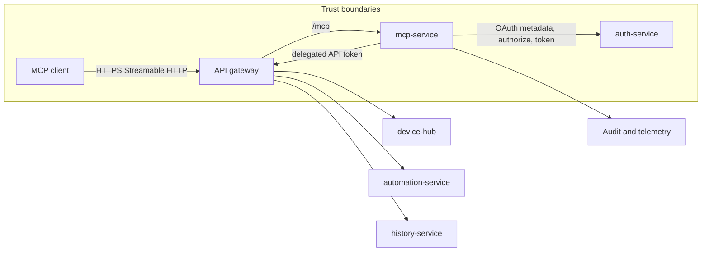
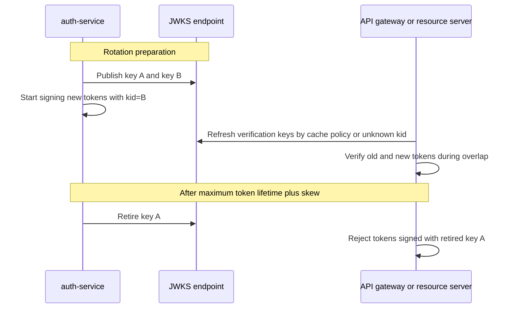
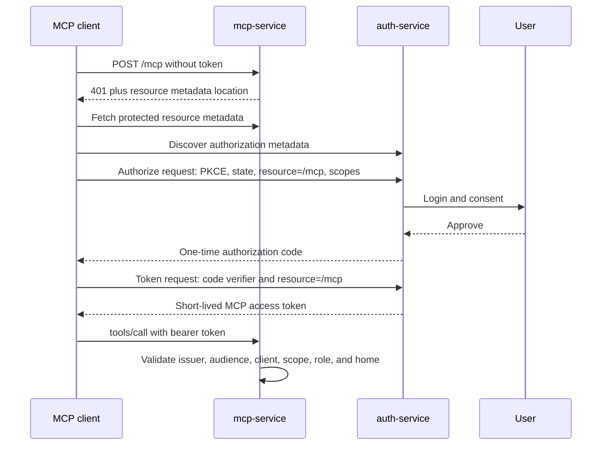
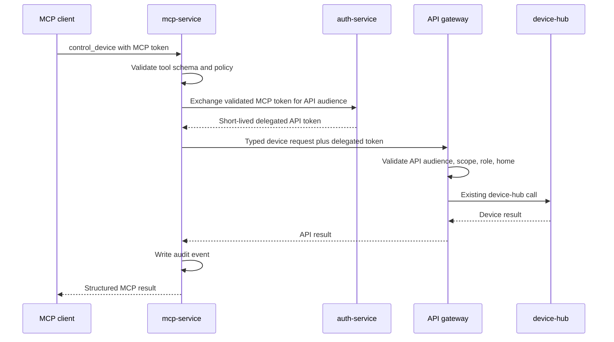

# Homenavi MCP and Authentication Security Roadmap

> Historical implementation roadmap. The OAuth, delegated-token, and MCP-service
> work described here is implemented; use [MCP](mcp.md) and
> [MCP Gateway Delegation Plan](mcp_gateway_delegation_plan.md) for the current
> operational design.

## Purpose

This roadmap introduces a first-party Homenavi Model Context Protocol (MCP) server
without weakening the authorization model that protects the existing web and API
surfaces. It also evolves `auth-service` from a browser-session token issuer into a
standards-based OAuth authorization server with secure, rotatable JWTs.

The target is a deliberate agent-control boundary: clients can perform a small set of
typed, policy-controlled home actions, but cannot use MCP as a generic proxy to REST,
HDP, MQTT, or internal services.

## Baseline Before Implementation

Homenavi currently signs RS256 access tokens that contain `sub`, `role`, `name`,
`iat`, and `exp`. `api-gateway` validates the signature and role hierarchy, then
protects routes with `auth`, `resident`, or `admin` access levels. Access tokens are
configured for 15 minutes and refresh tokens are stored in Redis.

This is a sound base for the existing application, but a remote MCP server requires
additional boundaries:

| Area               | Current state                                            | Target state                                                                                       |
| ------------------ | -------------------------------------------------------- | -------------------------------------------------------------------------------------------------- |
| Token identity     | No issuer, audience, client identity, scope, or token ID | Issuer, audience, scopes, client ID, token ID, token type, and home context                        |
| Key lifecycle      | One mounted RSA key pair                                 | Key ring with `kid`, JWKS publication, staged rotation, retirement, and emergency revocation       |
| Validation         | Signature, expiry, and role                              | Fixed algorithm, issuer, audience, time claims, token type, scopes, revocation, and home ownership |
| Refresh sessions   | Redis token lookup                                       | Rotating token families, reuse detection, device/session management, and logout-all                |
| MCP authorization  | Not present                                              | OAuth 2.1 authorization code with PKCE and resource-bound access tokens                            |
| Service delegation | Not present                                              | Token exchange that issues a separate downstream token; never forwards an MCP token                |
| Agent control      | Existing REST/HDP endpoints                              | Curated typed tools, resident/admin role gate, scopes, idempotency, audit, and kill switches        |

## Security Principles

1. Preserve the existing role model. Roles remain the baseline permission check;
   OAuth scopes only narrow what a token may do.
2. Bind every token to its intended recipient. A token issued for `/mcp` must not be
   accepted by the normal API gateway or another service.
3. Keep the model, MCP client, and retrieved content untrusted. Authorization,
   input checks, resource ownership, and capability checks run in deterministic code.
4. Do not expose a generic HTTP, HDP, MQTT, or WebSocket forwarding tool.
5. Make security decisions observable and reversible with audit records, revocation,
   per-client disablement, and a global MCP kill switch.

## Target Architecture

`mcp-service` is a first-party Go service deployed by the normal Compose and Helm
topology. It is not embedded in `api-gateway`; the gateway remains the public edge and
the MCP service owns protocol handling, policy, and audit behavior.



The public MCP endpoint uses Streamable HTTP at `/mcp`. It supports standard MCP
initialization and tool requests, validates the `Origin` header, enforces request and
response size limits, and applies IP limits at the gateway plus user/client limits at
`mcp-service`.

## JWT and Session Hardening

### Token Profile

All newly issued access tokens must use the following baseline profile:

```json
{
  "iss": "https://<installation>/api/auth",
  "sub": "<user-id>",
  "aud": ["homenavi-api"],
  "azp": "homenavi-web",
  "scope": "home.profile.read",
  "role": "resident",
  "home_id": "<home-id>",
  "jti": "<random-128-bit-id>",
  "sid": "<session-id>",
  "typ": "homenavi-api",
  "iat": 0,
  "nbf": 0,
  "exp": 0
}
```

`name` is optional display data and must not be used for authorization. `role` remains
authoritative only after user/session state and home ownership are checked. Claim names
and audiences are constants owned by a shared authentication package, not strings
duplicated across services.

### Signing and Verification

- Continue using asymmetric signatures, initially RS256 for compatibility.
- Pin accepted algorithms explicitly; reject `none`, symmetric algorithms, and
  unexpected asymmetric algorithms before claims processing.
- Add a `kid` header and maintain an active signing key plus one or more verification
  keys. Publish public keys from a JWKS endpoint. `kid` is the SHA-256 fingerprint
  of the PKIX-encoded public key, encoded with base64url without padding; aliases are
  not accepted because every issuer and verifier must use the same identifier.
- Load private signing keys from the deployment secret mechanism, never from images or
  source control. Prefer a managed KMS/HSM when deployments have one.
- Rotate keys with overlap: publish new verification key, issue with new `kid`, wait for
  the maximum token lifetime plus clock skew, then retire the old key.
- Validate `iss`, exact intended `aud`, `exp`, `nbf`, and bounded future `iat` with a
  small documented clock skew. Reject tokens that lack required claims or have an
  unknown token type.
- Do not log raw tokens, authorization headers, refresh tokens, authorization codes,
  or credential-bearing query strings.



### Refresh Tokens and Browser Sessions

Replace independent refresh-token records with a Redis-backed token family:

- Store only a hashed refresh-token value, family ID, session ID, client ID, user ID,
  issued time, expiry, and replacement relationship.
- Rotate refresh tokens on every use. If an already-used member is presented, revoke
  the entire family and its session, invalidating access tokens for that session
  immediately and requiring a new login.
- Resource servers must validate the active `sid` against the Redis session-status
  record on every API-token request. A missing or revoked record is unauthorized; an
  unavailable status store is a service-unavailable response, never a fail-open grant.
- Support user-visible session listing and targeted logout, plus logout-all and
  administrative session revocation.
- Bind browser sessions to an approved client and track coarse device metadata for
  anomaly detection without making it an authorization factor.
- Remove access and refresh tokens from redirect URLs. Use short-lived, one-time
  authorization codes and secure redirects instead.
- If browser authentication uses cookies, use `HttpOnly`, `Secure`, appropriate
  `SameSite`, CSRF protection for state-changing browser requests, and an allowlisted
  CORS origin policy.

### Multi-Factor Authentication

Support both email one-time passwords and authenticator applications. Authenticator
applications use RFC 6238 TOTP with six digits, a 30-second period, and an
`otpauth://` enrollment URI compatible with Google Authenticator and similar apps.
Email remains an available factor, but it is not a substitute for an authenticator
app when a policy requires phishing-resistant or stronger authentication.

- Model the enabled factor explicitly as `email` or `totp`; reject unknown factor
  values and require one verified factor before issuing a token pair.
- Require an authenticated, recently verified user session to begin enrollment,
  confirm enrollment with a valid TOTP code before enabling it, and never accept a
  caller-supplied user ID as authorization for factor changes.
- Generate a high-entropy TOTP secret, encrypt it at rest with a deployment-managed
  key, return the raw secret and QR-compatible URI only during enrollment, and keep
  both out of logs, metrics, audit payloads, and normal profile responses.
- Permit a narrowly bounded clock-skew window for TOTP validation, prevent a code
  from being accepted twice in the same time step, and rate-limit failures per user,
  IP address, and pending login challenge.
- Use single-use, short-lived email codes with the same rate limits. Do not log or
  return email codes, including in development fallbacks.
- Issue an opaque, short-lived login challenge after password verification. Bind the
  challenge to the user, selected factor, and requesting client; require it to finish
  MFA, and issue access and refresh tokens only after successful completion.
- Provide one-time recovery codes: generate them only after a factor is verified,
  store salted hashes, show each plaintext code once, consume them atomically, and
  force factor re-enrollment after recovery use.
- Require MFA or recovery-code confirmation to disable a factor, rotate a TOTP secret,
  generate recovery codes, or change a verified email address. Revoke active sessions
  after a security-factor reset and write an audit event for every factor lifecycle
  action without recording secrets or codes.

Implementation sequence:

1. Introduce an MFA-factor and login-challenge data contract in `auth-service` and
   `user-service`, then migrate the current `two_factor_*` fields without changing
   enabled users' factor choice.
2. Replace user-ID based setup and verification requests with authenticated endpoints
   bound to the API token subject and recent-authentication timestamp.
3. Add envelope encryption for persisted TOTP secrets, atomic recovery-code storage,
   and audit records for enrollment, verification, reset, and disablement.
4. Move email and TOTP completion behind the same challenge endpoint; retain the
   existing six-digit TOTP compatibility during the migration.
5. Release behind a feature flag, migrate existing TOTP users, require re-enrollment
   only where a secret cannot be safely migrated, and exercise rollback before making
   MFA mandatory for privileged roles.

## OAuth 2.1 for MCP

Auth-service is the Homenavi authorization server and MCP is a protected resource
server. Dynamic Client Registration is available for native loopback and approved VS
Code redirect URIs. Client revocation and registration abuse controls remain required
before broad public deployment.

Required endpoints and metadata:

| Surface                                   | Responsibility                                      |
| ----------------------------------------- | --------------------------------------------------- |
| `/.well-known/oauth-protected-resource`   | MCP resource metadata naming auth-service           |
| `/.well-known/oauth-authorization-server` | Authorization server metadata                       |
| `/api/auth/oauth/authorize`               | Authorization Code + PKCE interaction and consent   |
| `/api/auth/oauth/token`                   | Code exchange for scoped MCP access tokens          |
| `/api/auth/oauth/jwks.json`               | Public signing keys                                 |
| `/mcp`                                    | Streamable HTTP MCP endpoint                        |

The authorization code flow uses exact registered redirect URIs, `state`, PKCE S256,
short authorization-code expiry, single-use codes, and the OAuth `resource` parameter.
The user sees the MCP client name and requested scopes before consent is stored. A
valid existing Homenavi browser session proceeds directly to consent; otherwise normal
sign-in and configured 2FA are required. Consent records expire after 30 days.



### Token Audiences and Delegation

Use separate audiences and token types:

| Token                    | Audience                    | Accepted by        | Purpose                             |
| ------------------------ | --------------------------- | ------------------ | ----------------------------------- |
| Browser/API token        | `homenavi-api`              | API gateway        | Existing frontend/API requests      |
| MCP access token         | canonical public `/mcp` URI | `mcp-service` only | MCP client to Homenavi MCP endpoint |
| Delegated internal token | `homenavi-api`              | API gateway        | `mcp-service` acting for a user     |
| Service token            | named internal service      | named target only  | Non-user service-to-service work    |

When a tool calls an existing API, `mcp-service` exchanges the MCP token for a
short-lived delegated token. The delegated token carries the user subject, role, home,
scope ceiling, actor client, original token ID, and correlation ID. It is a new token,
not the incoming MCP bearer token.



## MCP Tool and Write Policy

Start with read-only tools: `list_devices`, `get_device`, `get_device_state`,
`list_rooms`, `list_automations`, `get_automation`, and `query_state_history`.

Add mutations in controlled phases:

| Risk level | Examples                                                                             | Required control                                                                                   |
| ---------- | ------------------------------------------------------------------------------------ | -------------------------------------------------------------------------------------------------- |
| Low        | Read device state, list automations                                                  | Scope, role, home ownership, audit                                                                 |
| Medium     | Set light state, thermostat setpoint                                                 | Resident/admin role, scope, typed schema, capability validation, idempotency key, audit             |
| High       | Unlock, pairing, delete automation, disable security rule, broad multi-device action | Not exposed through MCP until a dedicated server-side policy is implemented                         |

The server resolves device IDs, capabilities, type/range constraints, and target-home
membership itself. The model never supplies a raw downstream path or arbitrary payload.

## Phased Delivery Roadmap

### Phase 0: Security Baseline and Design

- Define shared claims, audiences, scopes, token types, key identifiers, and error
  contract in a Go package owned by auth-service.
- Inventory browser token storage, every token consumer, service-to-service token path,
  and external ingress origin before changing validation.
- Threat-model OAuth authorization, token theft, redirect compromise, cross-home IDOR,
  prompt injection, arbitrary tool invocation, and audit tampering.
- Define a rollback plan: validation feature flags, dual-key overlap, old-token
  compatibility window, and an MCP global disable switch.

Exit criteria: reviewed threat model; versioned claims contract; no unaccounted token
consumer; rollback path exercised in development.

### Phase 1: JWT Validation, Key Rotation, and Session Hardening

- Add `iss`, `aud`, `jti`, `nbf`, `typ`, and `kid` to new tokens.
- Update API gateway and services to enforce algorithm, issuer, expected audience, and
  time claim validation; retain role enforcement.
- Publish JWKS, implement key ring and staged rotation, and add integration tests for
  unknown/retired keys.
- Introduce refresh-token families, rotation, reuse detection, and session revocation.
- Harden existing email and TOTP MFA behind authenticated enrollment and opaque login
  challenges; encrypt TOTP secrets, add recovery codes, and audit factor changes.
- Eliminate authentication tokens from URLs and scrub sensitive headers from logs.

Exit criteria: all existing browser/API tests pass with new claim validation; automatic
key rotation works in staging; refresh replay revokes its token family; email and TOTP
MFA enrollment, login, recovery, and factor reset pass abuse and migration tests.

### Phase 2: OAuth Authorization Server Foundations

- Implement protected-resource and authorization-server metadata.
- Implement Authorization Code + PKCE, exact redirect URI allowlists, consent records,
  resource indicators, and short-lived resource-bound access tokens.
- Register a small allowlist of MCP clients administratively; expose client and consent
  revocation to administrators.
- Add OAuth conformance/interoperability tests before publishing `/mcp`.

Exit criteria: a real MCP client can discover metadata, authenticate with PKCE, receive
an MCP-audience token, and cannot use it against ordinary API routes.

### Phase 3: MCP Read-Only Pilot

- Add `mcp-service`, `/mcp` routing, Streamable HTTP protocol handling, origin policy,
  request limits, client/user rate limits, and OpenTelemetry instrumentation.
- Implement the read-only tool set with input and output JSON Schemas.
- Enforce scopes, role floors, home ownership, response redaction, and immutable audit
  events.
- Enable only trusted users in staging, then a small production allowlist.

Exit criteria: full protocol lifecycle passes; RBAC matrix passes; auditors can trace a
tool call to user, client, downstream correlation ID, and result.

### Phase 4: Delegated Mutations

- Implement token exchange and downstream delegated token validation.
- Add `control_device` for a narrow capability allowlist with idempotency and typed
  validation.
- Add per-tool feature flags, limits, and emergency disablement.

Exit criteria: no MCP token reaches API gateway or downstream services; replayed
idempotency keys are rejected; kill switch blocks new mutations.

### Phase 5: Operational Maturity

- Expand tools only after a security review and contract tests.
- Add client self-service only after Dynamic Client Registration abuse controls are
  designed and tested.
- Run quarterly key-rotation, token-revocation, incident-response, and restore drills.
- Review scope usage, denied requests, direct-write activity, and audit retention policy.

## Test and Release Gates

| Test layer           | Required cases                                                                                                                       |
| -------------------- | ------------------------------------------------------------------------------------------------------------------------------------ |
| Unit                 | Claim validation, `kid` selection, scope/role policy, idempotency, tool schemas, redaction                                            |
| Auth integration     | PKCE, state, exact redirects, code reuse, audience substitution, refresh replay, logout/revocation, MFA enrollment/login/recovery     |
| Gateway integration  | Valid and invalid issuer/audience/algorithm/time claims; resident/admin boundaries; rate-limit keys                                  |
| MCP integration      | Initialize, session lifecycle, origin checks, protocol versions, cancellation, request limits, structured output validation          |
| Authorization matrix | Unauthenticated, locked, revoked, user, resident, admin, disabled client, wrong scope, wrong home, expired and wrong-audience tokens |
| Adversarial          | Prompt-injected arguments, malicious device metadata, cross-home IDs, raw-path injection, idempotency replay, token theft simulation |
| End-to-end           | At least two MCP clients against Compose and staging, with audit-to-downstream trace correlation                                     |

Release conditions:

1. No generic proxy tool exists.
2. Every mutation is idempotent or explicitly non-idempotent, auditable, and retriable
   only under defined conditions.
3. Every public resource endpoint requires HTTPS in production and validates Origin.
4. Token audience substitution, refresh replay, and cross-home access are all blocked
   by executable tests.
5. Key rotation, client revocation, consent revocation, and MCP kill switch are tested
   before write-capable tools are enabled.

## References

- MCP Authorization: <https://modelcontextprotocol.io/specification/2025-06-18/basic/authorization>
- MCP Streamable HTTP: <https://modelcontextprotocol.io/specification/2025-06-18/basic/transports>
- MCP tools and security: <https://modelcontextprotocol.io/specification/2025-06-18/server/tools>
- OAuth 2.0 Resource Indicators (RFC 8707): <https://www.rfc-editor.org/rfc/rfc8707>
- OAuth 2.0 Protected Resource Metadata (RFC 9728): <https://www.rfc-editor.org/rfc/rfc9728>
- OWASP prompt injection guidance: <https://genai.owasp.org/llmrisk/llm01-prompt-injection/>

## Detailed Implementation Plan

This section turns the roadmap into a sequenced delivery plan. Each work package is
independently deployable behind a feature flag or compatibility setting. Do not expose
`/mcp` publicly until Work Package 6 has passed its quality gate.

### Repository Touchpoints

| Area                          | Planned touchpoint                                               | Responsibility                                                               |
| ----------------------------- | ---------------------------------------------------------------- | ---------------------------------------------------------------------------- |
| Auth configuration            | `auth-service/internal/app`                                      | Issuer, audience, key-ring, OAuth, token, and session configuration          |
| Token issuance and validation | `auth-service/internal/auth` and a shared authentication package | Claims, key selection, JWKS, authorization codes, refresh families, exchange |
| Auth HTTP surface             | `auth-service/internal/http`                                     | OAuth metadata, authorization, token, consent, JWKS, session endpoints       |
| Gateway token checks          | `api-gateway/internal/middleware/auth.go`                        | Algorithm pinning, issuer/audience/type validation, scope context            |
| Gateway routing               | `api-gateway/config/routes` and `api-gateway/internal/http`      | MCP reverse proxy, limits, Origin policy, correlation propagation            |
| MCP service                   | new `mcp-service/` Go module                                     | Streamable HTTP, tool registry, schemas, policy, audit                       |
| Local deployment              | `docker-compose.yml`, `docker-compose.ci.yml`, `.env.example`    | Service wiring, non-secret configuration, CI image targets                   |
| Kubernetes deployment         | `helm/homenavi` templates, values, CI values                     | Deployment, service, secret references, ingress route, probes, feature flags |
| Unit tests                    | affected Go package `*_test.go` files                            | Fast deterministic behavior and negative-path coverage                       |
| Compose smoke                 | `test/smoke/` and `api-gateway/test/`                            | Public ingress and cross-service critical paths                              |
| CI                            | `.github/workflows`                                              | Per-service verification, Compose smoke, Helm render, HA runtime smoke       |

No private key, refresh token, OAuth client secret, authorization code, or production
origin is committed to these files. Secrets remain deployment-provided.

### Work Package 0: Freeze Contracts and Establish Test Fixtures

**Goal:** make authorization behavior explicit before changing token semantics.

Implementation tasks:

1. Define a versioned claims package with constants for issuer, audiences, token types,
   scope names, role names, correlation claim, and clock-skew policy.
2. Define JSON Schema documents for initial MCP tools and direct-write payloads.
3. Create deterministic test principals: unauthenticated, user, resident, admin,
   locked resident, revoked resident, and a resident in a second home.
4. Create deterministic device fixtures: a writable light, read-only sensor, thermostat,
   unsupported capability, and device identifiers containing slashes.
5. Write a one-page token compatibility policy: which existing tokens remain accepted,
   when new validation begins, and the rollback switch.

Required unit tests:

- Scope parsing rejects duplicates, unknown scopes, malformed separators, and scopes
  outside the caller's role ceiling.
- Audience matching rejects an absent audience, a wrong audience, and an audience with
  a prefix/suffix match but no exact match.
- Home-resource checks reject a valid user accessing a device or automation in another
  home.

Quality gate: architecture/security review approves the claim names, scope vocabulary,
token compatibility policy, and fixture model. No runtime behavior changes in this
work package.

### Work Package 1: Harden Existing Browser and API JWTs

**Goal:** issue and validate well-defined API tokens without breaking current clients.

Implementation tasks:

1. Extend token issuance with `iss`, `aud`, `jti`, `nbf`, `typ`, `kid`, client ID, and
   home context. Preserve `sub` and `role` for compatibility.
2. Update verification to pin RS256 explicitly and reject every other algorithm.
3. Validate issuer, exact API audience, token type, expiry, not-before, and bounded
   issued-at time before role checks.
4. Add a migration setting that accepts legacy API tokens only during a measured
   transition window. Emit a metric for every legacy-token acceptance.
5. Update all gateway and service token consumers together; no service may silently
   downgrade to signature-only validation.
6. Remove authentication tokens from redirect URLs as part of the same release train;
   replace them with one-time authorization codes or a secure browser session flow.

Required unit tests:

- Valid RS256 token is accepted only for the configured issuer and API audience.
- `alg=none`, HS256, ES256, malformed headers, missing `kid`, and unknown `kid` fail.
- Expired, prematurely used, far-future issued-at, incorrect token-type, and malformed
  time claims fail with the correct 401 response.
- `resident` cannot reach `admin`; `admin` retains expected existing access.
- Legacy acceptance works only while its setting is enabled and increments the metric.

Required integration tests:

- Login, refresh, logout, and existing protected routes continue to work through
  `api-gateway` with the new token profile.
- An API token for one environment or issuer is rejected by another environment.
- A token for `homenavi-api` is rejected at a future MCP endpoint.

Quality gate: `go vet ./...`, `go test ./...`, gateway route authorization tests, and
Compose authentication smoke all pass. Zero legacy-token acceptances are observed in
staging for one access-token lifetime before disabling compatibility.

### Work Package 2: Key Ring, JWKS, and Revocable Sessions

**Goal:** rotate signing keys and revoke sessions safely.

Implementation tasks:

1. Introduce a key-ring interface with active signing key, verification keys, key
   status, activation time, and retirement time.
2. Publish a cacheable JWKS document containing active and overlap verification keys.
3. Add explicit key-rotation operations that publish, activate, observe overlap, and
   retire keys. Emergency retirement must be independently auditable.
4. Replace raw refresh-token storage with hashed, rotating token families and one-time
   refresh use.
5. Persist session ID, user ID, client ID, family ID, issue/expiry times, revoked time,
   replacement ID, and minimal device metadata in Redis.
6. Add current-session logout, session-list, targeted revoke, logout-all, and
   administrator revoke operations.

Required unit tests:

- JWKS exposes only public material and stable `kid` values.
- Key lookup distinguishes unknown, inactive, and retired keys without leaking private
  material.
- During overlap, both keys validate; after retirement, the retired key fails.
- Refresh rotation replaces the old token; reuse revokes the full family.
- Logout and user lockout invalidate the intended session set.

Required integration tests:

- Gateway refreshes JWKS on an unknown `kid` and validates a token signed by a newly
  activated key without restart.
- A reused refresh token invalidates sibling refresh tokens and API access according to
  the documented revocation policy.
- Key rotation completes while a Compose stack remains healthy.

Quality gate: a staging rotation drill succeeds using two keys, verifies old/new token
behavior at each stage, and leaves no private material in HTTP responses, logs, image
layers, or test artifacts.

### Work Package 3: OAuth Authorization Server Foundations

**Goal:** make auth-service a standards-compatible authorization server for a small,
pre-registered MCP client allowlist.

Implementation tasks:

1. Add authorization-server metadata, protected-resource metadata, authorization,
   token, JWKS, consent, and token-revocation endpoints.
2. Add client records with immutable client ID, display name, allowed redirect URIs,
   allowed scopes, status, creation/audit fields, and secret metadata for confidential
   clients.
3. Implement Authorization Code with PKCE S256, exact redirect matching, state
   preservation, one-time short-lived codes, and resource indicators.
4. Issue short-lived MCP access tokens whose audience is the canonical `/mcp` URI.
5. Make consent explicit and revocable. A changed scope set requires renewed consent.
6. Reject implicit flow, password grant, wildcard redirects, redirect URI fragments,
   loopback exceptions outside the documented local-development policy, and client
   supplied user identity.

Required unit tests:

- Metadata contains all endpoint URLs and supported grant/PKCE methods.
- Authorization rejects unknown client, disabled client, mismatched redirect, missing
  state, unsupported scope, missing resource, and invalid PKCE challenge.
- Token exchange rejects expired, reused, cross-client, cross-redirect, and wrong-
  verifier authorization codes.
- Consent revocation prevents new token issuance and refresh for that client.

Required integration tests:

- A real MCP test client discovers both metadata documents and completes PKCE.
- Authorization and token requests carry and enforce the canonical resource URI.
- The resulting MCP token is accepted only by mcp-service and rejected by API routes.

Quality gate: interoperability passes with two independent MCP clients in CI or staging;
all OAuth negative tests are blocking; no dynamic client registration is enabled.

### Work Package 4: Create and Verify mcp-service

**Goal:** deliver a read-only MCP service with no write capability and no proxy escape
hatch.

Implementation tasks:

1. Create `mcp-service` using the repository's Go service conventions: configuration,
   health/metrics, structured logging, tracing, Dockerfile, and a dedicated image
   workflow.
2. Implement Streamable HTTP `POST`, optional SSE `GET`, protocol version negotiation,
   initialization, session lifecycle, cancellation, and graceful shutdown.
3. Validate Origin before session allocation; bind local development only to localhost;
   enforce HTTPS at production ingress.
4. Validate MCP token issuer, exact MCP audience, token type, client status, consent,
   scope, role, home, and revocation before tool discovery or invocation.
5. Implement only read-only tools with strict JSON Schemas and structured output
   schemas. Return bounded, redacted results.
6. Write audit events for accepted and denied calls without logging bearer values.
7. Add a global `MCP_ENABLED` switch and per-tool feature flags, defaulting all tools to
   disabled outside test/development until explicitly enabled.

Required unit tests:

- JSON-RPC errors for invalid protocol version, malformed request, unknown tool, and
  schema violations.
- Origin mismatch, absent token, wrong audience, disabled client, revoked consent,
  wrong home, and missing scope are denied before downstream requests.
- Tool schemas reject extra properties, arbitrary paths, unknown capability IDs, and
  payloads exceeding configured size/depth limits.
- Redaction removes token-like fields, refresh fields, secret integration values, and
  private profile attributes.

Required smoke tests:

- Compose starts `mcp-service`; `/mcp` returns the expected unauthenticated challenge
  and metadata endpoint is reachable through the public ingress.
- An authenticated resident can call `tools/list` and one read-only tool through the
  gateway.
- An API-audience token is rejected at `/mcp`; an MCP-audience token is rejected at a
  normal protected API route.

Quality gate: read-only pilot runs in staging for at least one release cycle with audit
trace correlation, no generic proxy, no raw event/messaging tool, and no write tool.

### Work Package 5: Delegation and Controlled Device Writes

**Goal:** introduce the smallest useful mutation surface while retaining user-level
authorization.

Implementation tasks:

1. Add token exchange for mcp-service after it validates the inbound MCP token.
2. Issue a distinct, short-lived delegated API token containing subject, actor client,
   home, scope ceiling, original token ID, correlation ID, API audience, and delegated
   token type.
3. Update API gateway to require delegated token type and API audience when requests
   originate from mcp-service.
4. Implement `control_device` for an explicit capability allowlist. Resolve target,
   capability metadata, data type, range, and home membership server-side.
5. Require an idempotency key and record the normalized action digest, downstream
   result, and retry behavior.
6. Keep pairing, integration configuration, broad-device actions, unlocking, delete,
   and automation changes unavailable in this package.

Required integration tests:

- mcp-service exchanges a validated MCP token and never forwards it downstream.
- A forged delegated token, normal API token marked as delegated, and MCP token sent to
  API gateway all fail.
- `control_device` succeeds only for an authorized resident in the same home and a
  supported writable capability.
- Device IDs containing slashes and legacy provider aliases remain handled through
  typed validation, not raw path concatenation.
- Repeating an idempotency key returns the original result without a duplicate command.

Quality gate: security review of the tool's threat model and audit payload; the first
write tool is enabled only for a staging allowlist and is protected by the global kill
switch.

### Work Package 6: Role-Gated Direct Writes

**Goal:** support selected home and automation changes for resident and admin users
without a per-action browser confirmation.

Implementation tasks:

1. Require a resident or admin role and the tool's OAuth scope for every mutation.
2. Enforce typed inputs, capability validation, target-home ownership, and a scoped
  idempotency key before issuing a downstream request.
3. Keep high-risk tools unavailable until their server-side policy is explicitly
  implemented and reviewed.
4. Record every attempted mutation and its downstream correlation ID in audit logs.
5. Classify new tools as read-only, direct-write, or unavailable in version-controlled
  policy data; policy changes require review.

Required integration tests:

- User-role, missing-scope, revoked-session, and malformed-idempotency-key mutations fail.
- Reusing an idempotency key with changed input fails; retrying an unchanged request
  returns the original result.
- Direct writes generate exactly one downstream mutation and linked audit records.
- Global or per-tool disablement stops new direct writes.

Quality gate: at least one incident/rollback exercise demonstrates immediate disabling,
audit lookup, and no partial repeat after client retry.

## Detailed Test Requirements

### Unit Test Standard

All new Go packages require table-driven tests for success, boundary, malformed input,
and unauthorized behavior. Authentication and policy packages must target branch-level
coverage of every allow/deny decision; percentage coverage alone is not an acceptance
criterion.

Minimum unit-test groups:

| Component           | Required test groups                                                                                         |
| ------------------- | ------------------------------------------------------------------------------------------------------------ |
| Claims and verifier | Signature algorithm, issuer, audience, token type, `kid`, time claims, scope, role, home, revocation         |
| Key ring/JWKS       | Active/overlap/retired states, cache headers, unknown keys, public-only serialization                        |
| Refresh sessions    | Hashing, family rotation, reuse, logout, lockout, expiry, concurrent refresh race                            |
| OAuth               | Client status, redirect matching, state, PKCE, code lifecycle, consent, resource indicators, revocation      |
| MCP transport       | Initialization, versions, sessions, Origin, cancellation, malformed JSON-RPC, request limits                 |
| Tool policy         | Schema validation, policy class, redaction, capability lookup, IDOR prevention, idempotency                    |
| Audit               | Required fields, redaction, immutable event ordering, correlation propagation, denied events                 |

Run affected package tests with the race detector in CI for auth, gateway middleware,
session/revocation storage, and mcp-service:

```sh
go test -race ./...
```

### Compose Smoke Test Standard

Extend the existing `Docker Compose Smoke` workflow rather than creating a disconnected
test stack. Add `mcp-service` to its path filters, Compose configuration, readiness
checks, and failure diagnostics when the service exists.

Add `test/smoke/test_mcp_auth.py` or an equivalent Go test client that covers:

1. Public protected-resource metadata and authorization-server metadata availability.
2. Unauthenticated `/mcp` returns `401` with the correct `WWW-Authenticate` resource
   metadata pointer.
3. A resident completes the fixture OAuth PKCE flow and gets an MCP-only token.
4. `tools/list` and a read-only tool succeed through the public gateway.
5. Missing, expired, wrong-issuer, wrong-audience, and revoked tokens fail.
6. A normal API token cannot call MCP and an MCP token cannot call normal API routes.
7. A wrong Origin, oversized body, malformed JSON-RPC body, and unsupported protocol
   version fail before tool execution.
8. The audit event is emitted with correlation ID while the raw bearer token is absent
   from service logs.

Keep smoke tests bounded: use fixture users and devices only, no external OAuth
provider, no real integration credentials, and no timing assumptions longer than the
Compose workflow's existing budget.

### Integration Test Standard

Integration tests run against real auth-service, API gateway, Redis, mcp-service, and
fixture-backed downstream services. They test authorization propagation and stateful
behavior that cannot be proven with mocks.

Required scenarios:

| Scenario               | Expected result                                                                              |
| ---------------------- | -------------------------------------------------------------------------------------------- |
| Key overlap rotation   | Existing old-key token and new-key token work during overlap; old key fails after retirement |
| Refresh replay         | Reused refresh token revokes family and blocks future refresh                                |
| OAuth code replay      | First code exchange works; second fails without a new token                                  |
| Redirect attack        | Near-match, wildcard, fragment, cross-client, and unregistered redirects fail                |
| Resource substitution  | API token and MCP token are rejected by each other's resource server                         |
| Cross-home access      | Valid resident cannot enumerate or control another home's resources                          |
| Delegation             | Downstream sees delegated API token, never the inbound MCP token                             |
| Tool schema bypass     | Extra fields, raw paths, invalid capability values, and oversize payloads fail               |
| Idempotent control     | Same idempotency key produces one downstream command                                         |
| Idempotency replay     | Reusing a key with changed input fails; an unchanged retry returns the original result       |
| Revocation propagation | Client consent/session/key revocation blocks subsequent tool calls within documented latency |
| Kill switch            | Existing and new mutation attempts stop according to documented behavior                     |

### Security Regression Suite

Maintain a deterministic suite for the primary agent-specific threats. It must run on
every pull request that changes auth, gateway, mcp-service, shared claims, Compose, or
Helm files.

- Prompt-injected content in device names, automation names, integration metadata, and
  history entries cannot change server policy or cause a second tool call.
- Tool inputs cannot become arbitrary downstream URLs, SQL, shell arguments, MQTT
  topics, wildcard paths, headers, or bearer values.
- Error messages do not reveal other-home identifiers, key configuration, token claims,
  redirect URI inventory, or internal topology beyond what the caller may access.
- Load tests enforce per-IP, per-client, per-user, and per-tool limits without making
  authorization state inconsistent.
- Fuzz JSON-RPC parsing, JWT headers/claims, OAuth query parameters, and direct-write
  payloads. Preserve minimized regressions as fixtures.

## CI and Quality Gates

### Workflow Changes

When implementation starts, make the following CI changes in the same pull request as
the new service or security feature:

| Existing or new workflow            | Required change                                                                                                      |
| ----------------------------------- | -------------------------------------------------------------------------------------------------------------------- |
| `auth_service_docker_build.yaml`    | Run `go vet`, normal tests, race tests for auth/session packages, and build the auth image                           |
| `api_gateway_docker_build.yaml`     | Run gateway middleware/route tests plus race tests for authentication changes                                        |
| new `mcp_service_docker_build.yaml` | Run `go vet`, unit/race tests, schema checks, Docker build, and image artifact upload                                |
| `compose_smoke.yaml`                | Add MCP paths, readiness, auth/MCP smoke suite, and mcp-service logs on failure                                      |
| `helm_chart_validate.yaml`          | Render/lint default and MCP-enabled values; assert `/mcp`, service, probes, and secret references render as intended |
| `helm_minikube_ha_smoke.yaml`       | Build mcp-service image, add image override/deployment rollout, and run read-only MCP runtime smoke through gateway  |
| release workflows                   | Add MCP image release only after its build, Compose smoke, and Helm validation gates pass                            |

The auth and gateway workflows currently run `go vet ./...` and `go test ./...`; retain
those commands as the baseline. Add focused race jobs rather than enabling `-race` for
every unrelated service immediately. The Compose smoke workflow already provides the
right public-ingress test location and should remain the single cross-service smoke
entry point.

### Pull Request Gates

The following conditions block merge for changes touching the listed areas:

| Change area                  | Blocking gates                                                                                                           |
| ---------------------------- | ------------------------------------------------------------------------------------------------------------------------ |
| Claims, keys, refresh, OAuth | Auth unit/race tests, OAuth negative tests, secret scan, dependency scan, Compose auth smoke                             |
| Gateway auth/routing         | Gateway unit/race tests, route authorization matrix, Compose MCP/API audience separation smoke                           |
| MCP service/tools            | MCP unit/race tests, schema snapshots, security regression suite, Compose MCP smoke, Docker build                        |
| Helm/Compose                 | Render/lint, configuration assertions, Compose smoke; HA smoke for chart/runtime changes                                 |
| Write-capable tool           | All above plus delegation integration tests, idempotency tests, and security review                             |

Every security bug receives a regression test before closure. Every change to a scope,
role floor, token audience, tool schema, or direct-write policy updates its contract
snapshot and requires review from the code owner responsible for auth or gateway.

### Deployment Gates

1. **Development:** unit, race, schema, and local Compose smoke pass before opening a
   pull request.
2. **Pull request:** all affected blocking CI gates pass; artifact images are built but
   not published as release tags.
3. **Staging:** deploy with MCP enabled for an allowlist; run two-client OAuth
   interoperability, key rotation, revocation, audit correlation, and failure-injection
   tests.
4. **Production read-only:** enable read tools for a small user allowlist. Monitor deny
   rate, token validation failures, latency, tool errors, audit volume, and rate-limit
   events for one release cycle.
5. **Production writes:** require completed staging write drills, direct-write policy tests,
   incident rollback drill, documented on-call ownership, and explicit release approval.

### Evidence Required for Each Release

Attach or retain links to the following evidence in the release record:

- CI run IDs for unit, race, Compose smoke, Helm validation, and HA smoke where
  applicable.
- MCP client interoperability results and protocol version tested.
- Key rotation drill results with timestamps and active/retired `kid` values, never key
  material.
- OAuth and token-exchange negative test report.
- Audit trace samples covering allowed, denied, revoked, and direct-write calls.
- Feature-flag state, client allowlist, tool allowlist, rollback owner, and kill-switch
  verification result.

## Definition of Done

The MCP and enhanced authentication program is complete for a given write-capability
release only when:

1. The capability has a typed schema, scope, role floor, home ownership check, risk
   classification, rate budget, audit contract, and rollback/disable mechanism.
2. Unit, smoke, integration, and adversarial tests cover success and deny paths.
3. The feature works with a valid resource-bound MCP token and fails with browser/API,
   wrong-audience, expired, revoked, cross-home, and disabled-client tokens.
4. Key rotation, session/client/consent revocation, and the MCP kill switch are proven
   in the target deployment mode.
5. No test, log, image, metric label, audit field, or error response exposes a bearer
   token, refresh token, authorization code, private key, or client secret.
