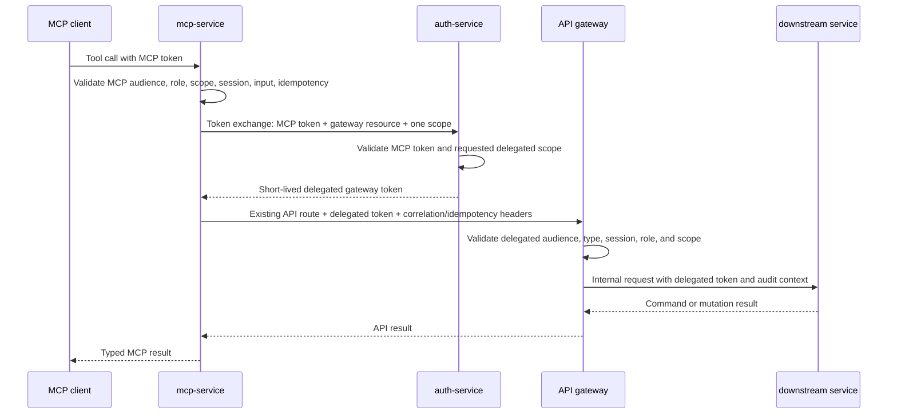
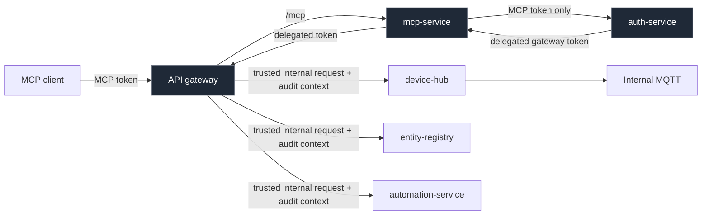

# MCP Gateway Delegation Plan

> Status: implemented. This document records the intended and delivered delegation
> design. For current operator and client guidance, use [MCP](mcp.md).

## Goal

Route every MCP-originated device, group, history, and automation operation through
the API gateway.
The gateway becomes the enforcement and audit boundary for these user-originated
operations, while MQTT and ordinary service-to-service traffic stay on the trusted
internal network without user bearer tokens.

The original MCP token is never accepted by the gateway and is never forwarded to a
downstream service. `mcp-service` exchanges it for a short-lived, gateway-audience
delegated token with only the requested scope.

## Implemented Request Flow

## Trust Boundaries

The second gateway hop is intentional. It applies the same route authorization and
audit behavior as other user-originated API calls. Device-hub and entity-registry
trust the internal network; automation-service also validates the delegated token it
receives. Internal MQTT is outside this user-token flow and remains protected by
network isolation and broker credentials.

## Implemented Design

### 1. Define the delegated gateway token contract

- Add a gateway resource/audience constant to `shared/authx` and configuration for
  its public URL.
- Extend token exchange to support the MCP tool scopes:
  `home.devices.read`, `home.devices.write`, `home.inventory.read`,
  `home.inventory.write`, `home.history.read`, `home.automation.execute`, and
  `home.automation.read`.
- Issue a two-minute token with `typ=homenavi-delegated`, the gateway audience,
  `sub`, `sid`, `role`, `azp`, one requested scope, `jti`, `iat`, `nbf`, and `exp`.
- Reject a requested scope that is absent from the original MCP token. Keep the
  resident/admin requirement at MCP issuance and MCP validation.
- Do not use the existing API-token type for delegated tokens; it would blur browser
  API and MCP delegation semantics.

### 2. Add route-scoped delegated authentication in the gateway

- Extend gateway claim parsing to retain `scope` and `azp`.
- Add a delegated-token validation configuration requiring the gateway audience and
  `homenavi-delegated` token type. Reuse signature, issuer, expiry, key ID, and
  session-revocation checks.
- Add scope middleware that checks the one delegated scope required by each route.
- Apply this middleware only to routes invoked by MCP. Existing browser/API routes
  continue to require `homenavi-api` tokens.
- Ensure the gateway rejects an MCP token, browser API token, wrong audience, wrong
  scope, revoked session, and non-resident role on every delegated route.

### 3. Expose the required gateway routes

- Confirm or add narrow gateway routes for each exposed device, inventory, history,
  and automation operation. Preserve their existing HTTP methods, payloads, and
  response contracts.
- Map required scopes:

| Gateway operation | Delegated scope |
| --- | --- |
| Device command | `home.devices.write` |
| Device read | `home.devices.read` |
| Inventory read | `home.inventory.read` |
| Device-group creation | `home.inventory.write` |
| State-history read | `home.history.read` |
| Automation workflow read | `home.automation.read` |
| Automation workflow run | `home.automation.execute` |

- Preserve `Idempotency-Key` and correlation/request ID headers through the gateway.
- Have gateway proxying attach trusted audit context headers (`X-Homenavi-Subject`,
  `X-Homenavi-Client-ID`, `X-Homenavi-Tool`, and the request ID). Downstream services
  treat these as internal-only audit metadata, never as external authorization.

### 4. Update mcp-service domain clients

- Add an `API_GATEWAY_URL` configuration value and a client used for all delegated
  MCP domain operations.
- Replace direct device-hub, entity-registry, history, and automation-service calls
  with gateway calls.
- Use `exchangeDelegatedToken` as the resource- and scope-specific exchange
  helper; use it for all delegated operations.
- Preserve local MCP validation before the exchange to avoid unnecessary auth-service
  calls for malformed input or insufficient scopes.

### 5. Tests and rollout

- Unit-test token exchange scope/audience/type restrictions in auth-service.
- Unit-test gateway delegated-token middleware for valid, wrong type, wrong audience,
  missing scope, revoked session, user role, resident role, and admin role cases.
- Add mcp-service tests that assert write clients call the gateway, send the delegated
  token, and preserve idempotency/correlation headers.
- Extend Compose smoke coverage: complete PKCE, discover write tools, execute one
  fixture device command and one group creation through the public gateway, and
  verify that raw MCP tokens cannot call normal API routes.
- Release behind `MCP_ENABLED`; observe gateway audit records and error rates before
  enabling write scopes for production clients.

## Acceptance Criteria

1. No MCP domain client calls device-hub, entity-registry, history, or
  automation-service directly.
2. No MCP token is accepted by the API gateway, and no browser API token is accepted
   by delegated MCP routes.
3. Every MCP domain operation has a gateway audit record containing subject, client ID, tool,
   scope, request ID, and downstream correlation ID.
4. Device commands, group creation, and automation runs retain idempotent retry
   behavior through the gateway.
5. MQTT and unrelated internal traffic continue without user bearer-token validation.