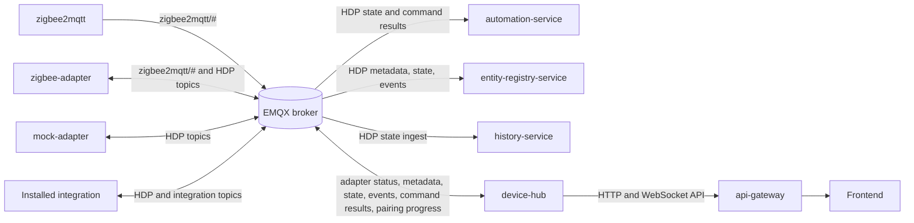
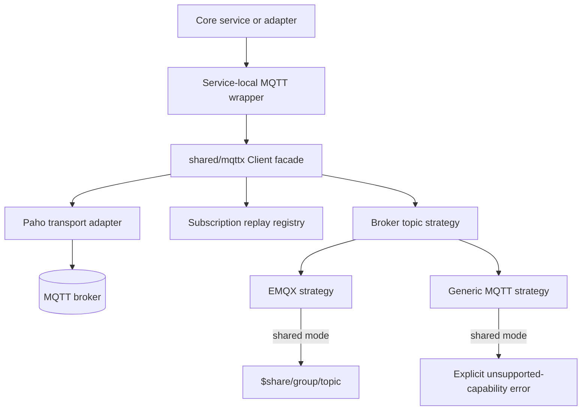
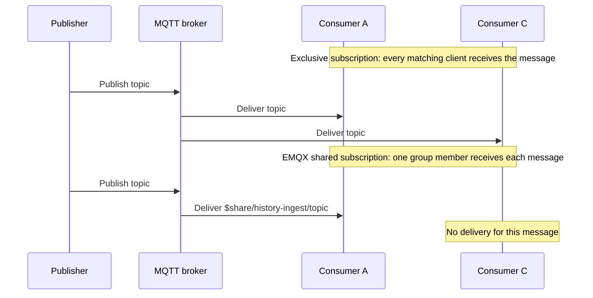
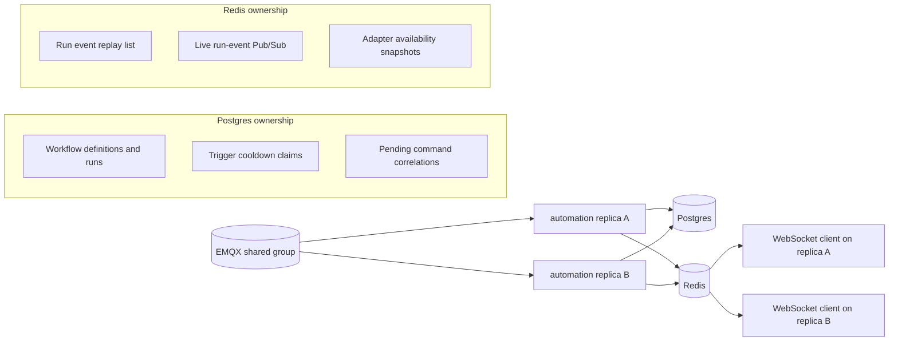
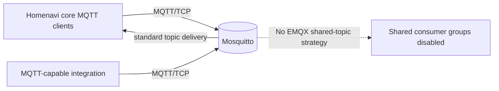

# MQTT Architecture and Broker Compatibility

## Purpose

This document describes the MQTT runtime used by Homenavi: the active broker, clients, HDP topic families, shared-consumer behavior, and the supported compatibility path for Mosquitto.

EMQX is the default broker for Docker Compose and Helm. Core services use `shared/mqttx`, which keeps service handlers independent from the Paho client library and isolates Paho in `shared/mqttx/paho_transport.go`.

## Core Topology



The broker carries device-plane messages. Browser clients do not connect to the broker directly; the API gateway exposes the browser-facing WebSocket path and services translate MQTT state into APIs, persistence, and realtime UI updates.

## Client-Layer Design



Responsibilities:
- Service-local wrappers define the narrow message and handler contracts required by the service.
- `shared/mqttx` owns connection lifecycle, subscription intent, broker capability checks, and replay after reconnect.
- The transport adapter owns Paho-specific APIs, TLS setup, credentials in the broker URL, and token waiting.
- Broker strategies resolve typed subscription intent into broker-specific topic syntax.

## HDP Topic Families

All Homenavi Device Protocol messages use the `homenavi/hdp/` root.

| Topic family | Typical publisher | Typical consumers | Purpose |
|---|---|---|---|
| `adapter/hello` | adapters | device-hub | Announces an adapter and supported capabilities. |
| `adapter/status/<adapter>` | adapters | device-hub | Retained adapter health and availability. |
| `device/metadata/<device>` | adapters/device-hub | device-hub, ERS | Device identity and capabilities. |
| `device/state/<device>` | adapters/device-hub | device-hub, history, automation, ERS | Device state, often retained. |
| `device/event/<device>` | adapters/device-hub | device-hub, ERS | Lifecycle and non-state events. |
| `device/command/<device>` | device-hub/automation | adapters | Command requests. |
| `device/command_result/<device>` | adapters/device-hub | device-hub, automation | Correlated command outcome. |
| `pairing/command/<protocol>` | device-hub | adapters | Start, stop, or configure pairing. |
| `pairing/progress/<protocol>` | adapters/device-hub | device-hub | Pairing lifecycle updates. |

## Delivery Modes



Current decisions:
- `history-service` can use `HISTORY_SERVICE_MQTT_SHARED_GROUP` for shared state ingestion.
- `entity-registry-service` can use `ENTITY_REGISTRY_MQTT_SHARED_GROUP` for shared metadata, state, and event auto-import.
- `automation-service` can use `AUTOMATION_SERVICE_MQTT_SHARED_GROUP`: Postgres claims trigger cooldowns and pending command correlations, while Redis shares run-event replay and live fan-out.
- `device-hub` can use `DEVICE_HUB_MQTT_SHARED_GROUP`: adapter availability is Redis-backed, device state is durable, and pairing transitions use Postgres protocol transactions.
- Zigbee and mock adapters remain exclusive singleton adapters.

## Stateless Service Direction



Automation shared mode is enabled only when `AUTOMATION_SERVICE_MQTT_SHARED_GROUP` is configured with an EMQX broker. Postgres provides durable claims and recovery state; Redis provides a bounded replay list that WebSocket replicas poll for cross-replica event delivery.

Device-hub can use the same shared-consumer model when `DEVICE_HUB_MQTT_SHARED_GROUP` is configured with EMQX. Postgres owns pairing transitions and lifecycle history; Redis provides adapter availability and active command coordination. See [doc/mqtt-ha-shared-subscriptions-plan.md](mqtt-ha-shared-subscriptions-plan.md).

## Docker Compose

Compose starts EMQX and injects these settings into core MQTT consumers:

```dotenv
MQTT_BROKER_URL=mqtt://emqx:1883
MQTT_BROKER_KIND=emqx
HISTORY_SERVICE_MQTT_SHARED_GROUP=
ENTITY_REGISTRY_MQTT_SHARED_GROUP=
AUTOMATION_SERVICE_MQTT_SHARED_GROUP=
DEVICE_HUB_MQTT_SHARED_GROUP=
```

To point the core services at another standard MQTT broker, set both values consistently. `MQTT_BROKER_KIND` controls broker capabilities; it is not inferred from the URL.

## Helm

Helm defaults to bundled EMQX and injects `MQTT_BROKER_URL` and `MQTT_BROKER_KIND` into services marked `usesMQTT`.

```yaml
dependencies:
  mqtt:
    provider: emqx

mqtt:
  brokerUrl: ""
  brokerKind: emqx

services:
    automation-service:
        env:
            AUTOMATION_SERVICE_MQTT_SHARED_GROUP: ""
```

For an externally managed standard broker, disable the bundled EMQX service through the existing dependency/provider configuration, set `mqtt.brokerUrl` to the reachable endpoint, set `mqtt.dependencyHost` and `mqtt.dependencyPort` for startup checks, and set `mqtt.brokerKind: generic`.

Integration-proxy Helm installs pass both `MQTT_BROKER_URL` and `MQTT_BROKER_KIND` to integration charts. Integration charts that use MQTT should accept and document both values; the integration template provides typed topic-resolution helpers in `src/backend/mqttsupport`.

## Enabling Shared Consumers

Shared mode is opt-in. Set a non-empty group only when using EMQX and when the service is deployed with Redis/Postgres dependencies available.

```dotenv
MQTT_BROKER_KIND=emqx
HISTORY_SERVICE_MQTT_SHARED_GROUP=history-ingest
ENTITY_REGISTRY_MQTT_SHARED_GROUP=entity-registry-autoimport
AUTOMATION_SERVICE_MQTT_SHARED_GROUP=automation-events
DEVICE_HUB_MQTT_SHARED_GROUP=device-hub-ingest
```

Do not set these group variables with `MQTT_BROKER_KIND=generic`. Startup validation rejects that incompatible combination.

## Mosquitto Compatibility

Mosquitto is compatible with Homenavi for normal MQTT publish/subscribe traffic.



Use the generic broker configuration:

```dotenv
MQTT_BROKER_URL=mqtt://mosquitto:1883
MQTT_BROKER_KIND=generic
```

With `MQTT_BROKER_KIND=generic`:
- all exclusive subscriptions continue to work
- `history-service` and `entity-registry-service` must leave their shared-group variables unset
- their startup configuration rejects a non-empty shared-group value with `MQTT_BROKER_KIND=generic`
- attempts to request `SubscriptionModeShared` fail explicitly instead of publishing an EMQX-specific `$share/...` topic to Mosquitto

Mosquitto can be used as an external broker or bridged into EMQX. For bridge direction and command-ownership rules, see [doc/mqtt_broker_topologies.md](mqtt_broker_topologies.md).

## Browser WebSockets

EMQX provides MQTT-over-WebSocket on port `8083` in Compose. The frontend does not use that listener directly; API Gateway handles browser-facing websocket routing.

When using Mosquitto, enable a WebSocket listener only if another component explicitly requires native MQTT-over-WebSocket. It is not a replacement for the API Gateway WebSocket API.

## Integration Author Guidance

Integrations should:
- use `MQTT_BROKER_URL` supplied by the runtime
- accept `MQTT_BROKER_KIND` when they expose shared-consumer options
- keep normal subscriptions exclusive by default
- use shared mode only for replay-safe worker workloads and only when broker kind is `emqx`
- publish HDP messages under the documented topic families

The integration template's `mqttsupport.ResolveSubscriptionTopic` demonstrates the same exclusive/shared resolution model without forcing a specific MQTT client library.