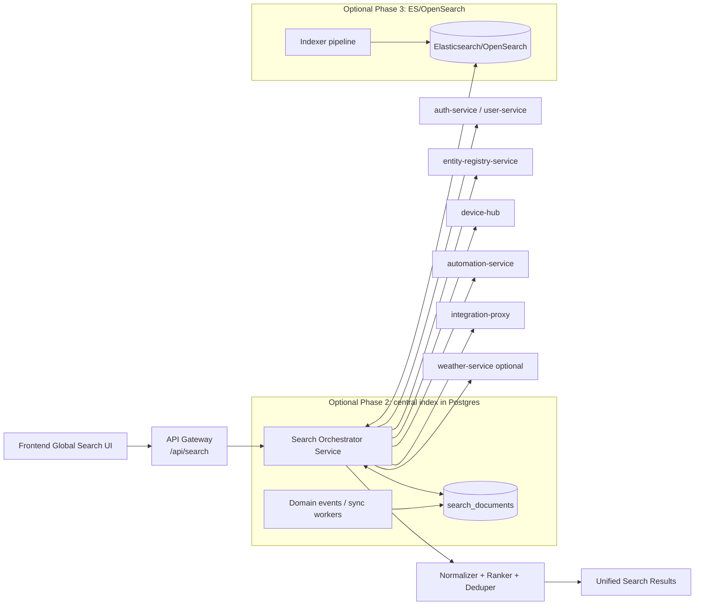

# Homenavi Search Feasibility Assessment

## Executive summary
Homenavi already has multiple search-like capabilities, but they are fragmented:
- Service-backed search for users (`/api/auth/users?q=` proxied to user-service query logic).
- Service-backed search for weather locations (`/api/weather/search?q=`).
- In-memory filtering for several UI screens (devices, groups, automation, integrations).
- Lightweight in-process search/filter in integration-proxy (`/integrations/registry.json?q=`).

A global search feature is feasible and useful, but introducing Elasticsearch immediately is likely not the best first step for this codebase today.

### Recommendation
Build a **phase 1 federated search API** behind API Gateway using existing services and existing PostgreSQL data first. Add ranking/aggregation and strict latency budgets. Re-evaluate Elasticsearch or OpenSearch only after measurable scale/latency thresholds are reached.

---

## What exists today (codebase evidence)

### 1. User directory search is already backend-driven
- `user-service` supports query filtering in SQL-like conditions using normalized columns and LIKE patterns.
- Relevant code:
  - `user-service/internal/http/users_handler.go`
  - `user-service/internal/infra/db/repository.go`

### 2. Weather location search is backend-driven (external provider)
- Gateway route exists for `/api/weather/search`.
- Frontend uses this for location lookup in widgets/dashboard flows.
- Relevant code:
  - `api-gateway/config/routes/weather.yaml`
  - `frontend/src/services/dashboardService.js`
  - `weather-service/internal/http/handler.go`

### 3. Integration catalog search is lightweight in integration-proxy
- Registry handler applies `q` filtering in memory over fetched integrations.
- Relevant code:
  - `integration-proxy/internal/http/registry.go`

### 4. Devices/groups/automation searches are mostly frontend filtering
- Current behavior for devices and several screens is client-side `includes(...)` filtering after loading a list.
- Relevant code:
  - `frontend/src/components/Devices/Devices.jsx`
  - `frontend/src/components/Groups/Groups.jsx`
  - `frontend/src/components/Automation/Automation.jsx`

### 5. Infrastructure baseline does not currently include Elasticsearch
- Current stack already runs many stateful components (Postgres, Redis, MinIO, EMQX).
- Elasticsearch/OpenSearch is not present in default compose stack.
- Relevant code:
  - `docker-compose.yml`

---

## Problem framing
A “search option” can mean very different things:
1. **Per-page filtering UX** (already mostly there).
2. **Global command palette / omnibox** (cross-domain: devices, rooms, groups, users, workflows, integrations).
3. **Full text and typo-tolerant search** with relevance ranking and facets.
4. **Audit/history/event search** over large time-series payloads.

If goal is #2 (most likely highest UX value), Elasticsearch is optional at first.
If goal is #4 at large scale, Elasticsearch/OpenSearch becomes much more attractive.

---

## Option analysis

## Option A: Federated search API over existing services (recommended first)
### Description
Add a new endpoint, for example:
- `GET /api/search?q=<text>&types=devices,users,groups,integrations,automations&limit=...`

Implement a small search orchestrator service (or API Gateway extension) that:
- Calls existing service APIs in parallel.
- Normalizes results to a shared schema.
- Applies relevance boosting and top-N clipping.

### Pros
- Fastest time-to-value.
- No new heavy stateful dependency.
- Reuses existing access-control boundaries (`auth`/`resident`/`admin`) by querying downstream with caller token context.
- Fits current microservice routing model in API Gateway.

### Cons
- Relevance quality limited by source API capabilities.
- Harder to optimize if one source is slow.
- Cross-source ranking is approximate.

### Feasibility
High. Most building blocks already exist.

---

## Option B: PostgreSQL-native search index (centralized, no Elasticsearch)
### Description
Create a dedicated `search-service` and `search_documents` table in Postgres:
- `entity_type`, `entity_id`, `title`, `subtitle`, `keywords`, `payload`, `tsvector`.
- Add GIN index (`tsvector`) and optional trigram indexes (`pg_trgm`) for typo-friendly matching.
- Feed index via domain events (preferred) or periodic pull/index sync jobs.

### Pros
- Better ranking and global relevance than Option A.
- Operationally simpler than Elasticsearch for many teams.
- Uses existing Postgres ops model.

### Cons
- Requires index pipeline and consistency handling.
- Limited compared to Elasticsearch for very large data or advanced linguistic features.

### Feasibility
High-to-medium. Strong next step if Option A proves useful.

---

## Option C: Elasticsearch/OpenSearch from day one
### Description
Introduce a search cluster and indexer pipeline:
- Domain services publish index events.
- Search index stores denormalized documents.
- Search API queries ES/OpenSearch directly.

### Pros
- Best relevance tooling, analyzers, fuzziness, facets, typo tolerance.
- Excellent for large-scale event/log/history search.

### Cons
- Highest operational burden (cluster health, memory tuning, backup, ILM, upgrades).
- Adds another critical stateful subsystem to an already multi-component platform.
- Requires security hardening for indexed personal data.

### Feasibility
Medium. Technically straightforward, operationally expensive.

---

## Is Elasticsearch worth it now?
### Short answer
Probably **not yet** for the first global search iteration.

### When it becomes worth it
Adopt ES/OpenSearch when at least one is true:
- Global search corpus exceeds low/mid six figures of documents with frequent updates.
- P95 search latency target is missed with Postgres/federated approaches.
- You need advanced relevance features: fuzziness, analyzers by locale, synonyms, weighted fields, faceted aggregations at scale.
- You want long-term searchable history/event corpus beyond transactional DB comfort.

### Practical threshold guidance
- Start with Option A if response size is modest and search types are mostly metadata.
- Move to Option B if quality/latency need a lift.
- Move to Option C only with observed evidence, not as a first assumption.

---

## Proposed target architecture (phase 1 -> phase 2)



---

## Suggested API contract

### Request
`GET /api/search?q=thermo&types=devices,users,groups,automations,integrations&limit=10`

### Response (example)
```json
{
  "query": "thermo",
  "took_ms": 42,
  "results": [
    {
      "type": "device",
      "id": "ers:device:uuid",
      "title": "Living Room Thermostat",
      "subtitle": "Room: Living Room · Protocol: zigbee",
      "score": 0.93,
      "url": "/devices?device=...",
      "actions": ["open", "toggle"]
    }
  ],
  "meta": {
    "partial": false,
    "sources": {
      "ers": {"took_ms": 8, "ok": true},
      "users": {"took_ms": 15, "ok": true}
    }
  }
}
```

---

## Security and access control implications
- Search must be role-aware (`auth`, `resident`, `admin`).
- Never leak entities user cannot access through side channels (counts, snippets, IDs).
- If indexing personal data, classify fields and apply minimization:
  - Keep IDs + display-safe metadata in index.
  - Avoid indexing secrets/tokens/private notes.
- Audit search queries if needed for admin/privacy compliance.

---

## Performance and reliability concerns
- Use fan-out with bounded concurrency and per-source timeouts.
- Return partial results when one source fails; include `partial=true` metadata.
- Cache hot query prefixes briefly (e.g., 10-30s) where safe.
- Add query length minimum (e.g., 2 chars) to prevent expensive scans.

---

## Implementation roadmap

## Phase 0: discovery and instrumentation (1-2 days)
- Define searchable entity types and result schema.
- Add baseline metrics on existing page-level search usage.

## Phase 1: federated global search MVP (4-8 days)
- Add `search-service` (or gateway extension) endpoint.
- Implement adapters for users, integrations, devices/groups/rooms, automations.
- Add ranking heuristics and dedupe.
- Add frontend omnibox component (keyboard shortcut + result navigation).

## Phase 2: quality and scale hardening (5-10 days)
- Add source-level caching and better ranking.
- Introduce Postgres `search_documents` for entities where source APIs are slow.
- Add GIN/trigram indexes and backfill job.

## Phase 3: evaluate ES/OpenSearch (conditional)
- Trigger only if SLO/corpus complexity requires it.
- Run a pilot with one high-volume entity class first.

---

## Effort / value matrix

| Approach | Initial effort | Ops cost | UX quality | Scalability | Recommendation |
|---|---:|---:|---:|---:|---|
| Option A Federated | Low | Low | Medium | Medium | Start here |
| Option B Postgres index | Medium | Low-Medium | High | Medium-High | Next step |
| Option C Elasticsearch | High | High | Very High | Very High | Conditional only |

---

## Final recommendation: is it worth it?
Yes, introducing a unified search option is worth it for Homenavi UX and navigation speed. It should reduce friction across Devices, Users, Groups, Automation, and Integrations.

However, introducing Elasticsearch immediately is likely overkill for the current architecture and ops profile. A staged path gives most of the user value with much less risk:
1. Federated search API now.
2. Postgres-backed central index if needed.
3. Elasticsearch/OpenSearch only when real scale/relevance requirements justify it.

This provides a high-confidence, low-regret path with measurable checkpoints.

---

## Appendix: concrete code touchpoints for MVP
- API ingress/routing model:
  - `api-gateway/internal/http/router.go`
  - `api-gateway/config/routes/*.yaml`
- Existing queryable sources:
  - `user-service/internal/http/users_handler.go`
  - `user-service/internal/infra/db/repository.go`
  - `integration-proxy/internal/http/registry.go`
  - `weather-service/internal/http/handler.go`
- Existing frontend local filtering patterns:
  - `frontend/src/components/Devices/Devices.jsx`
  - `frontend/src/components/Groups/Groups.jsx`
  - `frontend/src/components/Automation/Automation.jsx`
